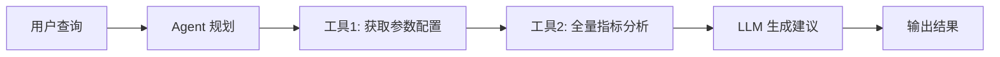

# AI A/B 测试参数智能搜索系统

基于 **DeepAgents** 的 A/B 测试智能分析系统：
- 🤖 **Agent 驱动**：使用 DeepAgents 框架，自主规划分析流程
- 🔧 **工具编排**：自动调用参数提取、指标获取、显著性分析等工具
- 🧠 **LLM 增强**：结合大模型理解实验上下文，生成调参建议
- 🌐 **浏览器认证**：Playwright 管理登录态，API 获取数据（零 DOM 依赖）

## 快速开始

### 1. 环境要求

- **Python 3.12**（项目强制要求，见 `.python-version`）
- Playwright（浏览器自动化）
- DeepAgents 0.3.1（Agent 框架）

### 2. 安装依赖

```bash
# 一键安装（推荐）
bash setup.sh

# 或手动安装
python3.12 -m venv venv
source venv/bin/activate  # Windows: venv\Scripts\activate
pip install -r requirements.txt
playwright install chromium
```

### 3. 配置文件

```bash
# 复制配置模板
cp config.example.yml config.yml

# 编辑 config.yml，填写实验信息和 LLM 配置
```

### 4. 首次登录（保存 Cookie）

```bash
# 自动保存 Cookie（推荐）
python scripts/save_cookies.py

# 或手动保存
python scripts/manual_save_cookies.py
```

Cookie 保存至 `data/cookies.json`，后续自动复用。

### 5. 运行分析

```bash
# 直接运行
python scripts/test_agent.py

# 或使用启动器（自动检查 Python 版本）
./run.sh scripts/test_agent.py
```

## 工作原理

### Agent 分析流程



**核心特点**：
- **自主规划**：Agent 根据查询自动决定调用哪些工具、调用顺序
- **上下文理解**：LLM 理解实验业务背景，而非简单规则匹配
- **工具编排**：2 个核心工具（参数提取、全量指标分析）高效协同

### 数据获取方式

| 数据类型 | 获取方式 | 技术实现 |
|---------|---------|---------|
| **Cookie 认证** | 首次手动登录 → 自动保存 → 后续复用 | Playwright Cookie 管理（5 天有效期） |
| **参数数据** | API-first（`page.evaluate(fetch)`） | 调用 `/api/abtest2/exp/experiment/group_params_info` |
| **指标数据** | 纯 API（`page.evaluate(fetch)`） | 调用 `/api/abtest2/metric/analysis/getAllMetrics`（含 7 天缓存） |

**关键优势**：
- ✅ **零 DOM 依赖**：前端改版不影响功能
- ✅ **性能提升**：API 调用比 DOM 解析快 8 倍，指标元数据缓存减少重复调用
- ✅ **稳定性**：限速 1 秒/次 + 3 次重试机制
- ✅ **低 Token 消耗**：精简 API 输出字段，仅保留决策核心数据

## 项目结构

```
ai-abtest-param-search/
├── scripts/
│   ├── test_agent.py              # ⭐ Agent 智能分析入口（主程序）
│   ├── save_cookies.py            # 自动保存 Cookie
│   └── manual_save_cookies.py     # 手动保存 Cookie
│
├── src/
│   ├── agents/                    # ⭐ Agent 系统（DeepAgents）
│   │   ├── ab_test_agent.py       # Agent 主逻辑（工具编排、LLM 调用）
│   │   ├── tools.py               # 工具定义（参数提取、指标获取、分析）
│   │   └── tool_call_tracker.py   # 工具调用追踪（防重复）
│   │
│   ├── api/                       # API 客户端（复用浏览器认证）
│   │   ├── params_api.py          # 参数 API（page.evaluate fetch）
│   │   └── metrics_api.py         # 指标 API（page.evaluate fetch）
│   │
│   ├── browser/                   # 浏览器控制
│   │   └── controller.py          # Playwright 封装、Cookie 管理
│   │
│   ├── scraper/                   # 数据提取（API-first）
│   │   ├── param_extractor.py     # 参数提取（API 优先，DOM 兜底）
│   │   └── metric_extractor.py    # 指标提取（纯 API）
│   │
│   ├── config/                    # 配置管理
│   │   ├── models.py              # Pydantic 数据模型
│   │   └── settings.py            # YAML 配置加载
│   │
│   └── utils/                     # 工具函数
│       ├── cookie_manager.py      # Cookie 持久化（多域名支持）
│       └── logger.py              # 日志配置
│
├── data/                          # 数据存储目录
│   ├── cookies.json               # 登录态 Cookie
│   ├── screenshots/               # 页面截图
│   ├── debug/                     # 调试信息（API 响应、HTML）
│   └── states/                    # 中间状态
│
├── docs/                          # 文档
│   ├── AB实验分析流程详解.md       # 技术流程文档
│   ├── TODO工具设计-调参建议生成.md # Agent 工具设计
│   └── TODO历史回溯抽象层-HAL方案.md # 历史数据管理方案
│
├── config.yml                     # 主配置文件（需手动创建）
├── config.example.yml             # 配置模板
├── requirements.txt               # Python 依赖
├── .python-version                # Python 版本锁定（3.12）
├── pyproject.toml                 # 项目元数据
├── setup.sh                       # 一键安装脚本
└── run.sh                         # 启动器（自动检查 Python 版本）
```

## 输出说明

### 终端输出
- **实时显示**：Agent 思考过程、工具调用、分析结果
- **彩色日志**：INFO 级别，便于快速定位问题

### 日志文件
- **路径**：`logs/test_agent-{timestamp}.log`
- **级别**：DEBUG（包含完整 API 请求/响应）
- **保留**：30 天，单文件最大 10MB

### 调试数据（可选）
- **API 响应**：`data/debug/` 目录
- **页面截图**：`data/screenshots/`
- **中间状态**：`data/states/`

## 常见问题

### Q: 为什么必须用 Python 3.12？
**A**: 项目依赖 DeepAgents 0.3.1 和 LangChain 最新版本，需要 Python 3.12 的类型系统特性。`.python-version` 和 `pyproject.toml` 已锁定版本。

### Q: Cookie 多久失效？
**A**: 平台 Cookie 有效期约 5 天。失效后重新运行 `scripts/save_cookies.py` 即可。

### Q: 如何切换不同实验？
**A**: 编辑 `config.yml` 中的 `abtest.url` 和 `abtest.target_parameter`，或在 Agent 查询中直接指定实验名称。

### Q: Agent 分析需要多久？
**A**: 
- 首次运行（含登录）：约 30-60 秒
- 后续运行（Cookie 复用）：约 10-20 秒
- 主要耗时：浏览器启动（5s）+ API 调用（1s/次 × 指标数）+ LLM 推理（5-10s）

### Q: 如何调试工具调用失败？
**A**: 
1. 查看 `logs/test_agent-{timestamp}.log` 的 DEBUG 日志
2. 检查 `data/debug/` 目录下的 API 响应
3. 确认 `config.yml` 中的实验 ID 和参数名称正确

## 文档索引

- [AB 实验分析流程详解](docs/AB实验分析流程详解.md) - 技术实现细节
- [开发路线图](docs/ROADMAP.md) - 功能规划与技术债务（⭐ 推荐）
- [工具设计 - 调参建议生成](docs/TODO工具设计-调参建议生成.md) - Agent 工具设计文档
- [Prompt 优化建议](docs/TODOPrompt优化建议-调参建议生成.md) - System Prompt 改进方案
- [历史回溯抽象层 HAL 方案](docs/TODO历史回溯抽象层-HAL方案.md) - 历史数据管理方案

## Roadmap

详见 [开发路线图](docs/ROADMAP.md)，包含：
- **短期目标（v0.2）**：调参建议生成优化、Prompt 优化、历史回溯 HAL
- **中期目标（v0.3）**：配置驱动化、结构化报告、错误处理增强
- **长期目标（v1.0）**：Web UI、参数自动调优、多平台支持

## License

MIT
