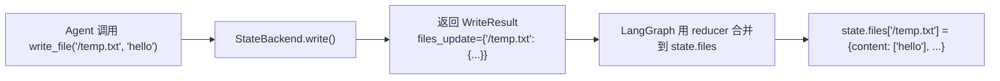
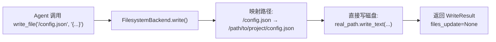
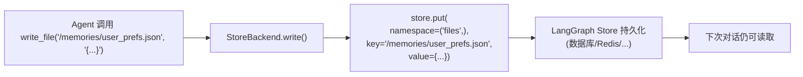
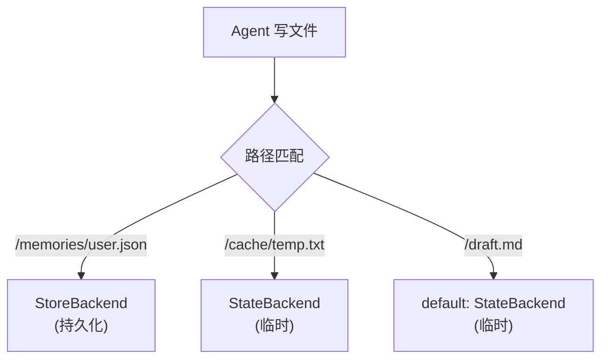
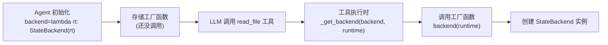
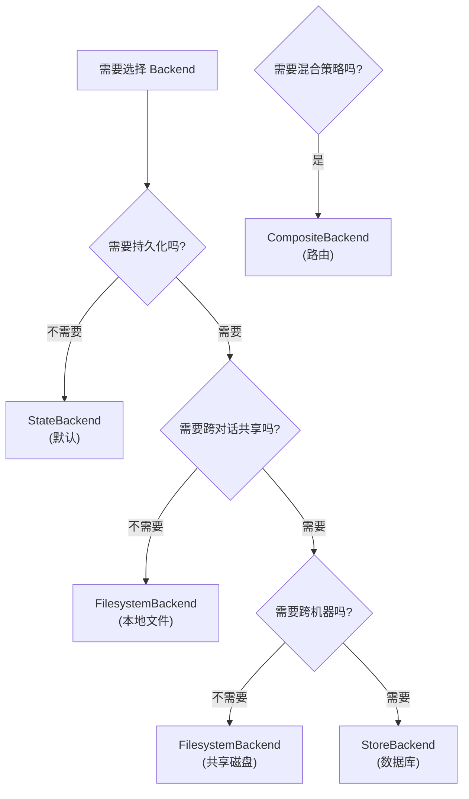

# Backend 到底是个啥?——从「抽屉」到「仓库」的进化史

## 核心问题:Agent 写的文件,到底存在哪?

想象你是个 AI Agent,刚写完一段代码,想保存到 `config.json`。这时候你会问:

- 存到**内存**里?下次对话就没了
- 存到**磁盘**上?那我能访问用户的真实文件吗?
- 存到**数据库**?跨对话还能读到吗?
- 存到**远程沙箱**?我在云端运行,本地磁盘根本碰不到

**Backend 就是回答这个问题的人**:它决定文件的「最终归宿」。

---

## 一、Backend 的本质:「存储策略的抽象」

### 1.1 用生活场景类比

把 Agent 想象成一个**办公室职员**:

| 场景 | 存储位置 | 对应 Backend | 特点 |
|-----|---------|-------------|------|
| 草稿纸上记笔记 | 桌面(用完就扔) | **StateBackend** | 临时,对话结束就清空 |
| 写到文件柜 | 办公室抽屉 | **FilesystemBackend** | 持久,但只能在这个办公室用 |
| 存到公司档案室 | 中央档案库 | **StoreBackend** | 跨办公室共享,永久保存 |
| 多策略混用 | 重要文件存档案室,草稿放桌面 | **CompositeBackend** | 路由:按文件路径决定存哪 |

**核心洞察**:Backend 不是「文件系统」,而是「存储策略」。

### 1.2 从代码看本质

Backend 是一个**协议(Protocol)**,定义了「存储系统必须会的 7 件事」:

```python
# libs/deepagents/deepagents/backends/protocol.py
class BackendProtocol(abc.ABC):
    # 1. 列出文件
    def ls_info(self, path: str) -> list[FileInfo]: ...
    
    # 2. 读文件
    def read(self, file_path: str, offset: int = 0, limit: int = 2000) -> str: ...
    
    # 3. 写新文件
    def write(self, file_path: str, content: str) -> WriteResult: ...
    
    # 4. 编辑文件
    def edit(self, file_path: str, old_string: str, new_string: str, replace_all: bool = False) -> EditResult: ...
    
    # 5. 搜索文本
    def grep_raw(self, pattern: str, path: str | None = None, glob: str | None = None) -> list[GrepMatch] | str: ...
    
    # 6. 匹配文件名
    def glob_info(self, pattern: str, path: str = "/") -> list[FileInfo]: ...
    
    # 7. 上传/下载(批量)
    def upload_files(self, files: list[tuple[str, bytes]]) -> list[FileUploadResponse]: ...
    def download_files(self, paths: list[str]) -> list[FileDownloadResponse]: ...
```

**关键点**:
- 这是个**接口规范**,不是具体实现
- 任何实现了这 7 个方法的类,都可以当 Backend 用
- FilesystemMiddleware 只调这些方法,不关心底层怎么存

> "Bad programmers worry about the code. Good programmers worry about data structures."  
> ——Linus Torvalds

Backend 协议就是那个「对的数据结构」。

---

## 二、四种 Backend 的真实面貌

### 2.1 StateBackend:「草稿纸」模式

**存在哪?** → LangGraph 状态字典的 `state.files` 字段

```python
# libs/deepagents/deepagents/backends/state.py
class StateBackend(BackendProtocol):
    def __init__(self, runtime: ToolRuntime):
        self.runtime = runtime  # 持有运行时上下文
    
    def write(self, file_path: str, content: str) -> WriteResult:
        # 把文件内容转成 LangGraph 状态格式
        lines = content.splitlines()
        now = datetime.now(UTC).isoformat()
        file_data = {
            "content": lines,  # 按行存储
            "created_at": now,
            "modified_at": now,
        }
        
        # 返回「状态更新建议」,由 LangGraph 合并
        return WriteResult(
            path=file_path,
            files_update={file_path: file_data}  # 这个会被写进 state.files
        )
```

**数据流向**:



**特点**:
- ✅ 开箱即用,不需要配置
- ✅ 数据在 LangGraph 状态里,可以被 checkpointer 持久化
- ❌ 对话结束后,如果没用 checkpointer,数据就丢了
- ❌ 不能访问真实文件系统

**适用场景**:
- Agent 的临时草稿
- 中间计算结果
- 不需要跨对话保存的数据

---

### 2.2 FilesystemBackend:「文件柜」模式

**存在哪?** → 真实磁盘的某个目录(如 `/path/to/project`)

```python
# libs/deepagents/deepagents/backends/filesystem.py
class FilesystemBackend(BackendProtocol):
    def __init__(self, root_dir: str, virtual_mode: bool = False):
        self.root_dir = Path(root_dir)  # 根目录
        self.virtual_mode = virtual_mode  # 是否虚拟化路径
    
    def write(self, file_path: str, content: str) -> WriteResult:
        # 把虚拟路径 /config.json 映射到真实路径 /path/to/project/config.json
        real_path = self.root_dir / file_path.lstrip("/")
        
        # 直接写磁盘
        real_path.parent.mkdir(parents=True, exist_ok=True)
        real_path.write_text(content, encoding="utf-8")
        
        # 返回结果,files_update=None 表示「我已经自己存好了,不需要 LangGraph 管」
        return WriteResult(
            path=file_path,
            files_update=None  # 关键!不依赖 LangGraph 状态
        )
```

**数据流向**:



**特点**:
- ✅ 操作真实文件,Agent 可以读写用户代码仓库
- ✅ 持久化,不依赖 LangGraph checkpointer
- ❌ 需要配置 `root_dir`,有安全风险(Agent 能访问磁盘)
- ❌ 不能跨机器共享(本地文件)

**适用场景**:
- 本地开发:Agent 帮你改代码
- 操作项目文件:读 `package.json`、写 `README.md`
- 需要持久化,但不需要跨对话共享

**安全措施**:
```python
# 路径校验,拒绝危险操作
def _validate_path(path: str):
    if ".." in path or path.startswith("~"):
        raise ValueError(f"Path traversal not allowed: {path}")
    if re.match(r"^[a-zA-Z]:", path):  # 拒绝 C:\
        raise ValueError(f"Windows absolute paths not supported: {path}")
```

---

### 2.3 StoreBackend:「档案室」模式

**存在哪?** → LangGraph Store(跨线程的持久化数据库)

```python
# libs/deepagents/deepagents/backends/store.py
class StoreBackend(BackendProtocol):
    def __init__(self, runtime: ToolRuntime):
        self.runtime = runtime
        self.store = runtime.store  # LangGraph 的 Store 实例
    
    def write(self, file_path: str, content: str) -> WriteResult:
        namespace = ("files",)  # 命名空间
        key = file_path  # 文件路径作为 key
        
        # 存到 LangGraph Store
        self.store.put(
            namespace=namespace,
            key=key,
            value={
                "content": content.splitlines(),
                "created_at": datetime.now(UTC).isoformat(),
                "modified_at": datetime.now(UTC).isoformat(),
            }
        )
        
        return WriteResult(
            path=file_path,
            files_update=None  # Store 自己管理持久化
        )
```

**数据流向**:



**特点**:
- ✅ 跨对话持久化(即使换线程也能读到)
- ✅ 可以用不同 Store 实现(内存/PostgreSQL/Redis)
- ❌ 需要配置 `store` 参数
- ❌ 不能直接访问磁盘文件

**适用场景**:
- 用户偏好设置
- Agent 的长期记忆
- 跨对话共享的知识库

---

### 2.4 CompositeBackend:「智能路由」模式

**核心思想**:根据文件路径,自动选择不同的 Backend。

```python
# libs/deepagents/deepagents/backends/composite.py
class CompositeBackend(BackendProtocol):
    def __init__(
        self,
        default: BackendProtocol,  # 默认 Backend
        routes: dict[str, BackendProtocol],  # 路由表:{路径前缀: Backend}
    ):
        self.default = default
        self.routes = routes
        # 按前缀长度排序(最长匹配优先)
        self.sorted_routes = sorted(routes.items(), key=lambda x: len(x[0]), reverse=True)
    
    def _route(self, path: str) -> BackendProtocol:
        """根据路径选择 Backend"""
        for prefix, backend in self.sorted_routes:
            if path.startswith(prefix):
                return backend
        return self.default  # 兜底
    
    def write(self, file_path: str, content: str) -> WriteResult:
        backend = self._route(file_path)  # 动态路由
        return backend.write(file_path, content)
```

**实战案例**:

```python
from deepagents.backends import CompositeBackend, StateBackend, StoreBackend

agent = create_deep_agent(
    backend=CompositeBackend(
        default=StateBackend(),  # 默认:临时存储
        routes={
            "/memories/": StoreBackend(),  # /memories/ 开头的文件 → 持久化
            "/cache/": StateBackend(),     # /cache/ 开头的文件 → 临时存储(显式声明)
        }
    )
)
```

**路由逻辑**:



**特点**:
- ✅ 灵活:不同路径用不同策略
- ✅ 透明:Agent 不需要知道路由规则
- ❌ 配置复杂:需要规划路径前缀

**适用场景**:
- 混合存储:重要数据持久化,草稿临时存
- 性能优化:热数据放内存,冷数据放数据库
- 安全隔离:敏感文件走加密 Backend

---

## 三、Backend 的「延迟绑定」黑魔法

### 3.1 为什么 Backend 可以是函数?

你可能注意到,Backend 有两种传法:

```python
# 方式 1:直接传实例
agent = create_deep_agent(backend=StateBackend(runtime))

# 方式 2:传工厂函数
agent = create_deep_agent(backend=lambda rt: StateBackend(rt))
```

**为什么要支持工厂函数?**

因为 Backend 需要 `ToolRuntime`,但创建 Agent 时,runtime 还不存在!

**解决方案**:延迟绑定——工具调用时才创建 Backend。

```python
# libs/deepagents/deepagents/middleware/filesystem.py
def _get_backend(backend: BACKEND_TYPES, runtime: ToolRuntime) -> BackendProtocol:
    """运行时解析 Backend"""
    if callable(backend):
        return backend(runtime)  # 调用工厂函数
    return backend  # 直接返回实例
```

**调用时机**:



**好处**:
- Backend 可以访问运行时状态(`runtime.state`)
- 支持动态配置(比如根据 `runtime.config` 选择 Backend)

---

## 四、Backend 的「返回值」设计哲学

### 4.1 WriteResult 的两种模式

```python
@dataclass
class WriteResult:
    error: str | None = None  # 错误信息
    path: str | None = None  # 文件路径
    files_update: dict[str, Any] | None = None  # 状态更新(可选)
```

**关键字段**:`files_update`

| Backend 类型 | files_update | 含义 |
|-------------|--------------|------|
| **StateBackend** | `{"/file.txt": {...}}` | 需要 LangGraph 更新状态 |
| **FilesystemBackend** | `None` | 已经自己存好了,不需要状态更新 |
| **StoreBackend** | `None` | 已经存到 Store,不需要状态更新 |

**工具如何处理?**

```python
# libs/deepagents/deepagents/middleware/filesystem.py
def sync_write_file(file_path: str, content: str, runtime: ToolRuntime) -> Command | str:
    res: WriteResult = resolved_backend.write(file_path, content)
    
    if res.error:
        return res.error  # 返回错误
    
    # 如果 Backend 返回了 files_update,就用 Command 更新状态
    if res.files_update is not None:
        return Command(
            update={
                "files": res.files_update,  # LangGraph 会合并到 state.files
                "messages": [ToolMessage(content=f"Updated file {res.path}", ...)]
            }
        )
    
    # 否则直接返回字符串
    return f"Updated file {res.path}"
```

**设计哲学**:
- Backend 决定「存储策略」
- 工具根据返回值决定「是否更新状态」
- LangGraph 负责「状态合并」

这是典型的**职责分离**:每个模块只做自己的事。

---

## 五、实战:如何选择 Backend?

### 5.1 决策树



### 5.2 典型场景

| 场景 | Backend 选择 | 配置示例 |
|-----|-------------|---------|
| **本地开发** | FilesystemBackend | `backend=FilesystemBackend(root_dir=".")` |
| **临时对话** | StateBackend | `backend=None`(默认) |
| **用户记忆** | StoreBackend | `backend=StoreBackend(store=PostgresStore(...))` |
| **混合存储** | CompositeBackend | `backend=CompositeBackend(default=StateBackend(), routes={"/memories/": StoreBackend()})` |
| **远程沙箱** | 自定义 SandboxBackend | `backend=ModalBackend(...)` |

---

## 六、拷问:Backend 设计「好」在哪?

### 6.1 用 Linus 的眼光审视

**【品味评分】🟢 好品味**

**【致命问题】无**

**【改进方向】**
- Protocol 定义简洁,7 个核心方法覆盖所有场景
- 返回值设计(`files_update`)消除了「Backend 是否需要状态更新」的 if-else 判断
- 工厂函数支持延迟绑定,避免循环依赖

**核心判断**:符合「好品味」三准则:
1. **数据结构第一**:Protocol 定义了数据关系,实现只是细节
2. **消除特殊情况**:所有 Backend 都返回 `WriteResult`,工具统一处理
3. **简洁直观**:`files_update=None` 就是「我自己搞定了」,不需要额外标志位

### 6.2 没有「过度设计」

**问题**:为什么不直接让每个 Backend 继承一个 `BaseBackend` 基类?

**答案**:因为 Protocol 比继承更灵活。

- **Protocol**:只要实现方法就行,不关心继承关系
- **继承**:强制子类继承父类的实现,容易引入不必要的依赖

**实际案例**:
```python
# 用户可以自己实现 Backend,不需要继承任何类
class S3Backend:
    def ls_info(self, path): ...
    def read(self, file_path, offset, limit): ...
    # ... 其他方法

# 只要实现了 Protocol,就能用
agent = create_deep_agent(backend=S3Backend(bucket="my-bucket"))
```

这就是 Python 的「鸭子类型」:走起来像鸭子,叫起来像鸭子,那就是鸭子。

---

## 七、一句话总结

**Backend 是 DeepAgents 中「存储策略的抽象」:它定义了文件的最终归宿(内存/磁盘/数据库/远程沙箱),通过 Protocol 统一接口,让 FilesystemMiddleware 不关心底层实现,只管调方法——这套设计让 Agent 在不同存储方案之间无感切换,同时保持代码简洁、扩展性强。**

---

## 八、思考题

1. **如果你要实现一个「只读 Backend」(Agent 只能读,不能写),需要改几行代码?**
   <details>
   <summary>答案</summary>
   
   只需要让 `write()` 和 `edit()` 返回错误:
   ```python
   class ReadOnlyBackend(FilesystemBackend):
       def write(self, file_path, content):
           return WriteResult(error="Read-only backend: write not allowed")
       
       def edit(self, file_path, old_string, new_string, replace_all=False):
           return EditResult(error="Read-only backend: edit not allowed")
   ```
   
   **零行 Middleware 代码改动**。
   </details>

2. **为什么 StateBackend 要返回 `files_update`,而不是直接修改 `runtime.state`?**
   <details>
   <summary>答案</summary>
   
   因为 LangGraph 的状态更新必须通过 **reducer** 合并,不能直接修改。
   
   如果直接改 `runtime.state["files"][path] = data`:
   - 破坏了 LangGraph 的状态管理机制
   - 无法触发 checkpointer 持久化
   - 无法支持文件删除(需要 reducer 处理 `None` 值)
   
   返回 `files_update` 让 LangGraph 用 `_file_data_reducer` 合并,保持架构一致性。
   </details>

3. **如果你想让 Agent 写文件时自动加密,应该改哪个模块?**
   <details>
   <summary>答案</summary>
   
   改 **Backend**,不改 Middleware。
   
   ```python
   class EncryptedFilesystemBackend(FilesystemBackend):
       def write(self, file_path, content):
           # 加密内容
           encrypted_content = encrypt(content)
           # 调用父类方法写入
           return super().write(file_path, encrypted_content)
       
       def read(self, file_path, offset, limit):
           # 读取后解密
           encrypted_content = super().read(file_path, offset, limit)
           return decrypt(encrypted_content)
   ```
   
   这就是「协议」的威力:扩展行为不影响 Middleware。
   </details>
