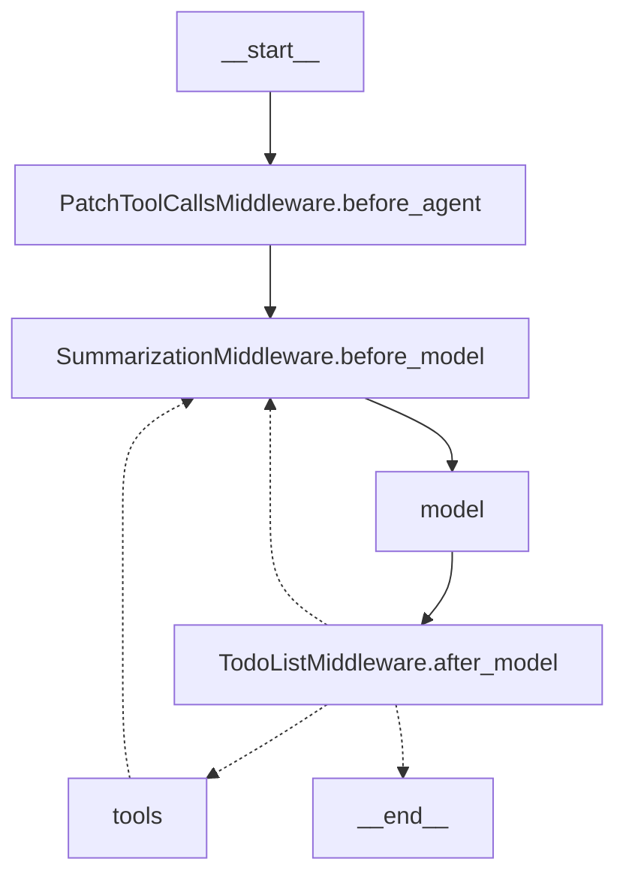

# DeepAgents：状态 Schema 与真实节点图（StateGraph）

> 目的：把你问的那句“`todos` 是状态字段，但不会从用户输入里读”讲清楚，并给出 **真实节点图**（不是我脑补的流程图）。
>
> 结论先放这：
> - **状态 schema**：定义“state 这个 dict 里允许有哪些 key、这些 key 如何合并(reducer)、哪些 key 不允许从输入注入”。
> - **状态机/节点图**：由 **LangGraph** 的 `CompiledStateGraph` 负责执行；LangChain 的 agent/middleware 负责“拼装节点与控制流”。

---

## 1. 什么是“状态 schema”？

在 LangChain/LangGraph 这一套里，所谓 **state** 本质上就是一个共享字典（TypedDict），例如：

- `messages`: 对话消息列表
- `todos`: todo 列表（planning）
- `files`: 文件系统中间件的状态
- `structured_response`: 结构化输出

而 **状态 schema（state_schema）** 就是：

> 用 Python 类型（`TypedDict` + `Annotated`）声明这个 state 里有哪些字段、字段类型是什么、字段的“合并/可见性”规则是什么。

LangChain 在 `AgentState` 里给了基础 schema：

```305:312:venv/lib/python3.11/site-packages/langchain/agents/middleware/types.py
class AgentState(TypedDict, Generic[ResponseT]):
    messages: Required[Annotated[list[AnyMessage], add_messages]]
    jump_to: NotRequired[Annotated[JumpTo | None, EphemeralValue, PrivateStateAttr]]
    structured_response: NotRequired[Annotated[ResponseT, OmitFromInput]]
```

关键点：
- `messages` 用 `add_messages` reducer 合并（这就是为什么消息会“追加”，不是覆盖）
- `jump_to` 是 runtime 控制流用的临时值（`EphemeralValue`）
- `structured_response` 标记了 `OmitFromInput`：**用户输入不能直接塞这个字段**

---

## 2. “`todos` 是状态字段，但不会从用户输入里读”怎么理解？

在 `TodoListMiddleware` 里，`PlanningState` 扩展了 `AgentState`：

```38:43:venv/lib/python3.11/site-packages/langchain/agents/middleware/todo.py
class PlanningState(AgentState):
    todos: Annotated[NotRequired[list[Todo]], OmitFromInput]
```

这里的 `OmitFromInput` 定义在 middleware types 里：

```284:299:venv/lib/python3.11/site-packages/langchain/agents/middleware/types.py
@dataclass
class OmitFromSchema:
    input: bool = True
    output: bool = True

OmitFromInput = OmitFromSchema(input=True, output=False)
```

**翻译成人话：**
- `todos` 是 state 里允许存在的字段（schema 认可它）
- 但 Graph 的“输入 schema”里会把它剔除：也就是你调用 `agent.invoke({"messages": ...})` 时，**就算你硬塞 `{"todos": ...}`，也不被当成合法输入的一部分**
- 所以 `todos` 只能通过“内部机制”写入：典型就是 `write_todos` 工具返回 `Command(update={"todos": ...})`

这就是为什么我说“不会从用户输入里读”：它是 **内部状态**，不是用户可注入的输入。

---

## 3. 有几种“状态”？你问的其实是两层状态

### 3.1 Todo item 的状态（业务层）

这是最直观的那层：

```28:35:venv/lib/python3.11/site-packages/langchain/agents/middleware/todo.py
class Todo(TypedDict):
    content: str
    status: Literal["pending", "in_progress", "completed"]
```

也就是说，todo 里每个任务只有三态：
- `pending`
- `in_progress`
- `completed`

### 3.2 Agent state 的状态（系统层）

这不是枚举态，而是一堆 state key：
- `messages`、`todos`、`files`、`jump_to`、`structured_response` ...

其中每个 key 还有自己的“合并语义”（append/overwrite/ephemeral）。

---

## 4. 状态机是什么样？靠谁维护？

你问“是靠 langGraph 还是 langChain 还是自己维护的能力？”——答案是：

- **LangGraph**：负责“状态机执行引擎”（StateGraph/CompiledStateGraph），核心是：节点读 state → 返回 partial update → 引擎合并到 state。
- **LangChain**：负责“agent loop + middleware 抽象 + tool node 组装”，并把这一套编译成 LangGraph 的图。
- **DeepAgents**：只是把若干 middleware 组装成默认配置（TodoList/Filesystem/Subagents/...），并暴露一个 `create_deep_agent()` 工厂。

LangGraph `StateGraph` 的核心描述就写在 docstring：

```111:119:venv/lib/python3.11/site-packages/langgraph/graph/state.py
"""A graph whose nodes communicate by reading and writing to a shared state.
The signature of each node is `State -> Partial<State>`.
Each state key can optionally be annotated with a reducer function...
"""

所以：**状态机=LangGraph**，不是 deepagents 手写的。

---

## 5. 真实节点图（来自 `create_deep_agent().get_graph().draw_mermaid()`）

我在当前仓库用 venv 的 Python 直接执行：

- `from deepagents.graph import create_deep_agent; a=create_deep_agent(); print(a.get_graph().draw_mermaid())`

得到的真实节点与连线如下（原样贴出，节点 label 用双引号包起来避免 mermaid 解析坑）：



### 5.1 这张图怎么读？

- `PatchToolCallsMiddleware.before_agent`：在 agent 开始前修补 tool_calls（避免模型输出不规范 tool call 时炸掉）
- `SummarizationMiddleware.before_model`：在进模型前做摘要/压缩（防 context 爆炸）
- `model`：LLM 调用
- `TodoListMiddleware.after_model`：在模型输出后做检查（比如同一轮多次 `write_todos` 直接报错），并决定下一跳
- `tools`：执行模型请求的工具（包括 `write_todos`）

`write_todos` 本质上发生在：**model → tools → (Command.update 写 state.todos) → 回到 before_model → 下一轮**。

---

## 6.（你可能真正关心的）为什么 `todos` 的 reducer 没显式写？

你会注意到：
- `messages` 明确有 `add_messages`
- `todos` 没写 reducer

因为 `write_todos` 的语义就是“整体替换”，框架用 `Command(update={"todos": todos})` 直接把字段写掉就够了。
再搞 reducer 只会制造边界情况。

