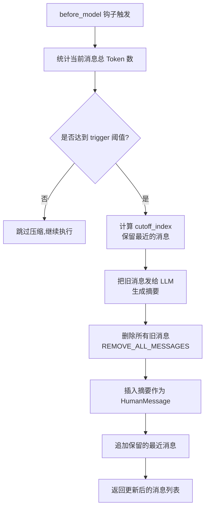

# SummarizationMiddleware：Deepagents 如何控制上下文窗口不爆炸

**核心问题：当对话历史越来越长,Token 超过了模型的最大输入限制怎么办?**

答案很直接：**自动压缩旧对话,保留最近的关键信息**。这就是 `SummarizationMiddleware` 存在的唯一理由。

---

## 一句话总结

`SummarizationMiddleware` 在 Token 数量接近模型上限时触发,把旧消息发给 LLM 生成摘要,然后删除旧消息、插入摘要、保留最近的消息,从而把上下文窗口控制在安全范围内。

---

## LangChain、LangGraph、DeepAgents 三者的关系

在开始分析 `SummarizationMiddleware` 之前,先把这三个框架的关系理清楚。

### 架构层次

```
┌──────────────────────────────────────┐
│         DeepAgents                   │  ← 应用层:装配标准中间件
│  (装配 TodoList/Filesystem/Subagents) │
└──────────────┬───────────────────────┘
               │
┌──────────────▼───────────────────────┐
│         LangChain                    │  ← 中间件层:提供可复用组件
│  (提供 Middleware/Tools/ChatModels)  │
└──────────────┬───────────────────────┘
               │
┌──────────────▼───────────────────────┐
│         LangGraph                    │  ← 执行引擎层:状态机和消息流
│  (StateGraph/CompiledStateGraph)    │
└──────────────────────────────────────┘
```

### 具体分工

1. **LangGraph**：提供状态机执行引擎
   - 核心类：`CompiledStateGraph`
   - 职责：管理状态流转、消息传递、节点调度
   - 类比：操作系统内核

2. **LangChain**：提供中间件和工具生态
   - 核心抽象：`AgentMiddleware`
   - 提供的中间件：
     - `TodoListMiddleware` - 任务规划
     - `SummarizationMiddleware` - 上下文压缩
     - `HumanInTheLoopMiddleware` - 人机交互
   - 职责：定义"什么时候、怎么处理"消息和工具调用
   - 类比：系统库和驱动

3. **DeepAgents**：应用层组装
   - 核心函数：`create_deep_agent()`
   - 职责：把 LangChain 的中间件按标准配置接入 LangGraph
   - 类比：操作系统发行版(Ubuntu/Fedora)

### 调用链路示例

```python
# 在 deepagents/graph.py 中
from langchain.agents import create_agent  # ← LangChain 提供
from langchain.agents.middleware.summarization import SummarizationMiddleware
from langgraph.graph.state import CompiledStateGraph  # ← LangGraph 提供

def create_deep_agent(...) -> CompiledStateGraph:
    deepagent_middleware = [
        TodoListMiddleware(),
        FilesystemMiddleware(...),
        SummarizationMiddleware(  # ← DeepAgents 装配时传入参数
            model=model,
            trigger=("fraction", 0.85),  # 85% 时触发
            keep=("fraction", 0.10),      # 保留 10%
        ),
    ]
    
    return create_agent(  # LangChain 的工厂函数
        model, tools, middleware=deepagent_middleware
    )  # 返回的是 LangGraph 的 CompiledStateGraph
```

**结论**：`SummarizationMiddleware` 是 LangChain 实现的中间件，DeepAgents 负责装配和配置，最终运行在 LangGraph 的状态机上。

---

## SummarizationMiddleware 的实现原理

### 设计哲学

这个中间件的设计非常务实：**不等炸了再救,提前预判触发**。

配置了两个参数：
- `trigger`：什么时候开始压缩?(比如 Token 数达到模型上限的 85%)
- `keep`：压缩后保留多少?(比如最近 10% 的 Token)

这两个参数可以用三种方式指定：

```python
# 1. 按比例 - 基于模型 profile 的 max_input_tokens
("fraction", 0.85)  # 85% 的模型最大输入 Token 数

# 2. 按绝对数量
("tokens", 170000)  # 17 万 Token

# 3. 按消息数量
("messages", 50)    # 50 条消息
```

### 核心流程



### 源码对应

**文件路径**：`venv/lib/python3.11/site-packages/langchain/agents/middleware/summarization.py`

#### 1. 触发检测

```python
def before_model(self, state: AgentState, runtime: Runtime) -> dict[str, Any] | None:
    messages = state["messages"]
    total_tokens = self.token_counter(messages)
    
    if not self._should_summarize(messages, total_tokens):
        return None  # 不触发压缩
    
    # ... 开始压缩流程
```

#### 2. 判断是否应该压缩

```python
def _should_summarize(self, messages: list[AnyMessage], total_tokens: int) -> bool:
    if not self._trigger_conditions:
        return False
    
    for kind, value in self._trigger_conditions:
        if kind == "messages" and len(messages) >= value:
            return True
        if kind == "tokens" and total_tokens >= value:
            return True
        if kind == "fraction":
            max_input_tokens = self._get_profile_limits()
            threshold = int(max_input_tokens * value)
            if total_tokens >= threshold:
                return True
    return False
```

#### 3. 计算 cutoff 点(保留哪些消息)

这里有个非常聪明的设计：**不能拆散 AI 和 Tool 消息对**。

为什么?因为 LLM 调用工具会产生两条消息：
1. `AIMessage` - 包含 `tool_calls`
2. `ToolMessage` - 工具的返回结果

如果只保留 `ToolMessage` 而丢掉 `AIMessage`,上下文就乱套了。

```python
def _find_safe_cutoff_point(self, messages: list[AnyMessage], cutoff_index: int) -> int:
    if cutoff_index >= len(messages) or not isinstance(messages[cutoff_index], ToolMessage):
        return cutoff_index
    
    # 收集 cutoff 点之后的所有 ToolMessage 的 tool_call_id
    tool_call_ids: set[str] = set()
    idx = cutoff_index
    while idx < len(messages) and isinstance(messages[idx], ToolMessage):
        tool_msg = messages[idx]
        if tool_msg.tool_call_id:
            tool_call_ids.add(tool_msg.tool_call_id)
        idx += 1
    
    # 向前找到包含这些 tool_call_id 的 AIMessage
    for i in range(cutoff_index - 1, -1, -1):
        msg = messages[i]
        if isinstance(msg, AIMessage) and msg.tool_calls:
            ai_tool_call_ids = {tc.get("id") for tc in msg.tool_calls}
            if tool_call_ids & ai_tool_call_ids:
                return i  # 把 AIMessage 也保留
    
    # 如果没找到,至少跳过所有 ToolMessage
    return idx
```

**这就是 Linus 说的"好品味"**：不是用 if 判断堆满特殊情况,而是用数据结构设计消除边界情况。通过 `tool_call_id` 建立关联,自动找到配对的消息。

#### 4. 生成摘要

```python
def _create_summary(self, messages_to_summarize: list[AnyMessage]) -> str:
    if not messages_to_summarize:
        return "No previous conversation history."
    
    # 如果消息太多,先裁剪到合理长度
    trimmed_messages = self._trim_messages_for_summary(messages_to_summarize)
    formatted_messages = get_buffer_string(trimmed_messages)
    
    try:
        response = self.model.invoke(self.summary_prompt.format(messages=formatted_messages))
        return response.text.strip()
    except Exception as e:
        return f"Error generating summary: {e!s}"
```

默认的 `summary_prompt` 告诉 LLM：

```
你快超过最大输入 Token 了,把下面的对话历史提取最重要的上下文，
这段上下文会替换掉完整历史,所以必须包含所有关键信息。
确保不重复已完成的动作,只保留对当前目标最重要的内容。
```

#### 5. 替换消息列表

```python
return {
    "messages": [
        RemoveMessage(id=REMOVE_ALL_MESSAGES),  # 删除所有旧消息
        *new_messages,                          # 插入摘要
        *preserved_messages,                    # 追加保留的最近消息
    ]
}
```

`REMOVE_ALL_MESSAGES` 是 LangGraph 提供的特殊标记,告诉状态机"清空所有消息"。

---

## DeepAgents 如何配置 SummarizationMiddleware

在 `deepagents/graph.py` 中：

```python
if (
    model.profile is not None
    and "max_input_tokens" in model.profile
):
    # 如果模型有明确的最大输入 Token 限制
    trigger = ("fraction", 0.85)  # 达到 85% 时触发
    keep = ("fraction", 0.10)      # 保留最近 10% 的 Token
else:
    # 如果没有,使用固定值(兜底策略)
    trigger = ("tokens", 170000)   # 17 万 Token 触发
    keep = ("messages", 6)         # 保留最近 6 条消息

deepagent_middleware = [
    TodoListMiddleware(),
    FilesystemMiddleware(backend=backend),
    SubAgentMiddleware(...,
        default_middleware=[
            TodoListMiddleware(),
            FilesystemMiddleware(...),
            SummarizationMiddleware(  # ← 子 Agent 也有压缩
                model=model,
                trigger=trigger,
                keep=keep,
                trim_tokens_to_summarize=None,
            ),
            ...
        ]
    ),
    SummarizationMiddleware(  # ← 主 Agent 的压缩
        model=model,
        trigger=trigger,
        keep=keep,
        trim_tokens_to_summarize=None,
    ),
    ...
]
```

**关键设计决策**：

1. **基于模型 profile 自适应**：如果 Claude 告诉你"我最多支持 20 万 Token",DeepAgents 会自动设置在 17 万(85%)时触发压缩,压缩后保留 2 万(10%)。

2. **主 Agent 和 SubAgent 都配置**：避免子任务也撑爆上下文。

3. **`trim_tokens_to_summarize=None`**：生成摘要时不裁剪待压缩消息。这个参数的默认值是 `4000`,意思是"如果要压缩的消息太多,只取最近 4000 Token 发给摘要模型"。DeepAgents 设置为 `None` 表示不裁剪,全部发给 LLM。

---

## 与 LangChain、LangGraph 的关系

### AgentMiddleware 的生命周期钩子

LangChain 定义了 `AgentMiddleware` 基类,提供了多个钩子：

```python
class AgentMiddleware:
    def before_agent(self, state, runtime) -> dict | None:
        """Agent 启动前调用"""
        pass
    
    def before_model(self, state, runtime) -> dict | None:
        """调用 LLM 前调用"""  # ← SummarizationMiddleware 用这个
        pass
    
    def after_model(self, state, runtime) -> dict | None:
        """LLM 返回后调用"""
        pass
    
    def wrap_model_call(self, request, handler):
        """包装 LLM 调用过程"""
        pass
    
    def wrap_tool_call(self, request, execute):
        """包装工具调用过程"""
        pass
```

`SummarizationMiddleware` 只用了 `before_model`,因为它只需要在"准备调用 LLM 前"检查 Token 数量。

### LangGraph 的消息管理

LangGraph 的状态机通过 `add_messages` reducer 管理消息列表：

```python
class AgentState(TypedDict):
    messages: Annotated[list[AnyMessage], add_messages]
```

`add_messages` 支持三种操作：
1. **追加消息**：直接 append
2. **删除消息**：通过 `RemoveMessage(id=...)`
3. **删除所有消息**：通过 `RemoveMessage(id=REMOVE_ALL_MESSAGES)`

`SummarizationMiddleware` 用的就是第 3 种。

### create_agent 如何接入 Middleware

在 LangChain 的 `create_agent` 工厂函数中：

```python
def create_agent(model, tools, middleware, ...) -> CompiledStateGraph:
    # 1. 合并所有 middleware 的状态 schema
    state_schemas = {AgentState, *(m.state_schema for m in middleware)}
    merged_schema = _resolve_schema(state_schemas, "MergedState")
    
    # 2. 创建 StateGraph
    graph = StateGraph(merged_schema)
    
    # 3. 添加 model 节点和 tools 节点
    graph.add_node("model", model_node_func)
    graph.add_node("tools", tools_node_func)
    
    # 4. 在 model 节点前注入 before_model 钩子
    for mw in middleware:
        if hasattr(mw, 'before_model'):
            # 包装 model 节点,先调用 before_model
            ...
    
    # 5. 编译成 CompiledStateGraph
    return graph.compile(checkpointer=checkpointer)
```

关键点：**LangChain 负责编排中间件钩子的调用顺序,LangGraph 负责执行状态流转**。

---

## 实际运行时的 Token 统计

`SummarizationMiddleware` 用 `token_counter` 函数统计 Token 数量。默认是 `count_tokens_approximately`,但对于 Anthropic 模型会调优参数：

```python
def _get_approximate_token_counter(model: BaseChatModel) -> TokenCounter:
    if model._llm_type == "anthropic-chat":
        # Claude 的 Token 计数规律：平均 3.3 个字符 = 1 Token
        return partial(count_tokens_approximately, chars_per_token=3.3)
    return count_tokens_approximately
```

**为什么不直接用模型的 Token 计数 API？**

因为调用 API 会产生额外开销。这里的目标是"快速估算",不是"精确计数"。误差在 5% 以内完全可以接受。

---

## 一个有意思的测试：小心测试

你可能会问："怎么测试这个中间件?"

看看 LangChain 的做法：

```python
# 测试文件中
def test_summarization_triggered():
    middleware = SummarizationMiddleware(
        model="openai:gpt-4",
        trigger=("messages", 3),  # 3 条消息就触发
        keep=("messages", 1),     # 只保留最后 1 条
    )
    
    agent = create_agent("openai:gpt-4", middleware=[middleware])
    
    # 发送 5 条消息
    result = agent.invoke({
        "messages": [
            HumanMessage("第 1 条"),
            HumanMessage("第 2 条"),
            HumanMessage("第 3 条"),  # 这里触发压缩
            HumanMessage("第 4 条"),
            HumanMessage("第 5 条"),
        ]
    })
    
    # 验证：消息列表应该只剩下 摘要 + 最后 1 条
    assert len(result["messages"]) == 2
    assert "summary" in result["messages"][0].content.lower()
```

**测试的艺术**：把复杂的生产场景简化成"3 条消息触发、保留 1 条",既验证了逻辑,又避免了真的发送 17 万 Token 到 API。

---

## 总结：SummarizationMiddleware 的核心价值

### 1. 解决的问题

**防止上下文窗口爆炸**。没有这个中间件,长对话的 Agent 迟早会因为 Token 超限而崩溃。

### 2. 设计的好品味

- **不拆散 AI/Tool 消息对**：通过 `tool_call_id` 建立关联,自动保持成对
- **基于模型 profile 自适应**：不同模型自动调整阈值
- **提前预判,不等炸了再救**：在 85% 时触发,不是 100%

### 3. 与 LangChain/LangGraph 的关系

- LangChain 提供 `AgentMiddleware` 抽象和 `SummarizationMiddleware` 实现
- LangGraph 提供状态机和消息管理机制(`add_messages` reducer)
- DeepAgents 负责按合理参数装配到生产环境

### 4. 如果要自己实现一个,核心逻辑是什么?

```python
class MySummarizationMiddleware(AgentMiddleware):
    def before_model(self, state, runtime):
        messages = state["messages"]
        
        # 1. 统计 Token
        total_tokens = count_tokens(messages)
        
        # 2. 判断是否触发
        if total_tokens < self.trigger_threshold:
            return None
        
        # 3. 计算 cutoff(保留最近的消息)
        cutoff_index = self._find_cutoff(messages)
        
        # 4. 生成摘要
        old_messages = messages[:cutoff_index]
        summary = self.llm.invoke(f"Summarize: {old_messages}")
        
        # 5. 替换消息列表
        return {
            "messages": [
                RemoveMessage(id=REMOVE_ALL_MESSAGES),
                HumanMessage(f"Summary: {summary}"),
                *messages[cutoff_index:],  # 保留最近的
            ]
        }
```

**Bad programmers worry about the code. Good programmers worry about data structures.**

`SummarizationMiddleware` 的精髓不在代码有多复杂,而在于如何处理消息列表这个数据结构：删除、摘要、保留,三个操作保证上下文不丢失又不超限。

---

## 你问我答

**Q: 为什么不直接用滑动窗口(只保留最近 N 条消息)?**

A: 因为会丢失早期的关键信息。摘要可以把"用户的初始目标""已完成的步骤"压缩成几句话,而滑动窗口会完全丢弃。

**Q: 摘要会不会失真?**

A: 会。但这是一个 trade-off：要么失真但能继续工作,要么不失真但 Token 超限直接挂掉。在工程上,能运行的 90 分方案优于理论完美但用不了的 100 分方案。

**Q: 为什么 DeepAgents 设置 `trim_tokens_to_summarize=None`?**

A: 因为 DeepAgents 已经有了 `trigger` 控制触发时机,不需要再裁剪待摘要的消息。如果 `trigger=("fraction", 0.85)`,意味着触发时最多只有 85% 的 Token,完全在模型能处理的范围内。

**Q: 能不能不用 LLM 生成摘要,用规则提取?**

A: 可以,但效果会差。LLM 能理解语义,知道哪些信息重要；规则只能机械式地"取前 N 句"或"删掉重复内容"。如果你的场景对成本敏感,可以用小模型生成摘要,比如 GPT-3.5。

---

**最后一句话**：`SummarizationMiddleware` 不是创新,是工程必需品。任何长对话的 Agent 都需要这个机制,区别只在于触发时机和压缩策略。LangChain 的实现已经打磨得很成熟,DeepAgents 直接拿来用就行。这就是开源生态的价值——不用每个轮子都自己造。
