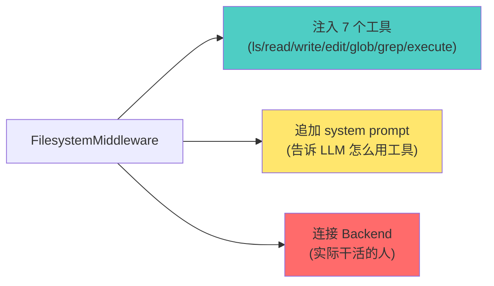
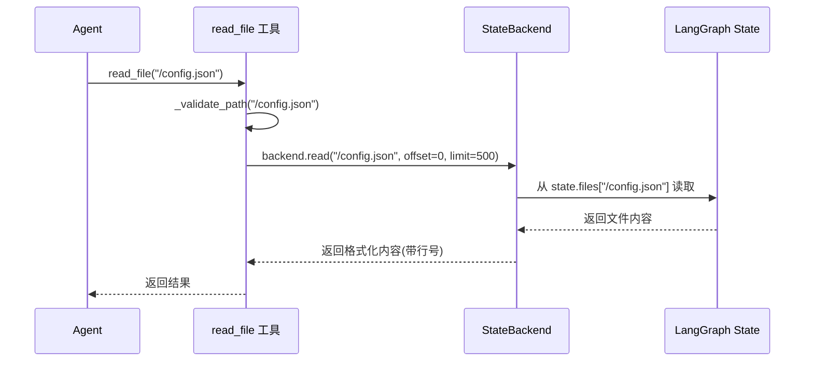

# FilesystemMiddleware 实现解析：DeepAgents 如何用「协议 + 插件」消灭文件系统差异

## 核心问题：你是否好奇 Agent 的「手」伸向哪里?

想象这样一个场景:
- Claude 写完代码,想读个配置文件——它该从内存读、磁盘读,还是远程沙箱读?
- 你希望 `/memories/` 目录永久保存,其他文件用完就扔——这该怎么做?
- 有些 Agent 能 `execute("ls -la")`,有些只能读写文件——为什么?

**这篇文章只回答一件事**:FilesystemMiddleware 怎么让 Agent 在不同存储后端之间「无感切换」,以及它和 LangChain/LangGraph 到底是什么关系。

---

## 一、从「看起来」到「实际上」:FilesystemMiddleware 不造文件系统

### 1.1 它只做三件事



**核心洞察**:Middleware 本身不碰文件,它只是个「工具箱组装员」。真正读写的活儿,全委托给 **Backend**。

这个设计哲学很像古代兵器库的管理:
- **库官**(Middleware):负责把刀枪棍棒摆好,告诉将军怎么用
- **匠人**(Backend):实际打造兵器,修理刀刃

"工具是死的,打造工具的人是活的。" ——这就是 Backend 存在的意义。

### 1.2 「协议 + 插件」的真实面貌

DeepAgents 用了一个很狠的设计:定义 **BackendProtocol**,然后让所有存储方案都实现它。

```python
# libs/deepagents/deepagents/backends/protocol.py
class BackendProtocol(abc.ABC):
    def ls_info(self, path: str) -> list["FileInfo"]: ...
    def read(self, file_path: str, offset: int = 0, limit: int = 2000) -> str: ...
    def write(self, file_path: str, content: str) -> WriteResult: ...
    def edit(self, file_path: str, old_string: str, new_string: str, replace_all: bool = False) -> EditResult: ...
    def grep_raw(self, pattern: str, path: str | None = None, glob: str | None = None) -> list["GrepMatch"] | str: ...
    def glob_info(self, pattern: str, path: str = "/") -> list["FileInfo"]: ...
```

这就是那把「尺子」:不管你是磁盘(FilesystemBackend)、内存(StateBackend)、数据库(StoreBackend),都得按这个规范来。

> "Theory and practice sometimes clash. Theory loses. Every single time."  
> ——Linus Torvalds

Protocol 不是为了理论美,而是为了实战:让 Middleware 不关心细节,只管调接口。

---

## 二、Backend 家族:从临时工到长工

DeepAgents 内置了三种 Backend,外加一个组合拳:

| Backend 类型 | 数据存在哪 | 生命周期 | 典型场景 |
|-------------|-----------|---------|---------|
| **StateBackend** | LangGraph 状态字典 `state.files` | 单次对话,结束即清空 | Agent 临时草稿、中间结果 |
| **FilesystemBackend** | 真实磁盘目录(如 `/path/to/project`) | 持久化,由文件系统托管 | 操作本地代码仓库 |
| **StoreBackend** | LangGraph Store(跨线程数据库) | 跨对话持久化 | 用户偏好、知识库 |
| **CompositeBackend** | 多种 Backend 混用(路由器) | 混合策略 | `/memories/` 永久保存,其他临时 |

### 2.1 StateBackend:开箱即用的「黑板」

```python
# 默认行为:不配置 backend 就是 StateBackend
agent = create_deep_agent()  # 内部: backend=lambda rt: StateBackend(rt)
```

数据写进哪?写进 **LangGraph 状态的 `files` 字段**。

```python
# libs/deepagents/deepagents/backends/state.py
class StateBackend(BackendProtocol):
    def __init__(self, runtime: ToolRuntime):
        self.runtime = runtime
    
    def write(self, file_path: str, content: str) -> WriteResult:
        # 直接修改 state.files
        lines = content.splitlines()
        now = datetime.now(UTC).isoformat()
        file_data = {
            "content": lines,
            "created_at": now,
            "modified_at": now,
        }
        return WriteResult(
            path=file_path,
            files_update={file_path: file_data}  # 返回给 LangGraph 的状态更新
        )
```

**关键点**:StateBackend 返回 `files_update`,由 LangGraph 的 `_file_data_reducer` 合并到状态里。

这个设计很有「品味」:
- Backend 不直接操作状态,只返回「建议更新」
- LangGraph 用 reducer 处理合并逻辑(比如删除文件时传 `None`)
- 符合「单向数据流」原则

### 2.2 FilesystemBackend:Agent 的「真手」

```python
from deepagents.backends import FilesystemBackend

agent = create_deep_agent(
    backend=FilesystemBackend(root_dir="/path/to/project")
)
```

这时候,Agent 就真的在操作你的磁盘了。

```python
# libs/deepagents/deepagents/backends/filesystem.py
class FilesystemBackend(BackendProtocol):
    def write(self, file_path: str, content: str) -> WriteResult:
        real_path = self.root_dir / file_path.lstrip("/")
        real_path.write_text(content, encoding="utf-8")
        return WriteResult(
            path=file_path,
            files_update=None  # 已经写到磁盘了,不需要 LangGraph 状态更新
        )
```

**注意差异**:
- StateBackend:`files_update` 有值,依赖 LangGraph 状态
- FilesystemBackend:`files_update=None`,自己已经落盘

这就是「协议」的威力:Middleware 只看返回值,不管底层实现。

### 2.3 CompositeBackend:路由黑魔法

```python
from deepagents.backends import CompositeBackend, StateBackend, StoreBackend

agent = create_deep_agent(
    backend=CompositeBackend(
        default=StateBackend(),  # 默认存内存
        routes={"/memories/": StoreBackend()}  # /memories/ 走持久化
    )
)
```

**核心逻辑**:按路径前缀路由。

```python
# libs/deepagents/deepagents/backends/composite.py
class CompositeBackend(BackendProtocol):
    def _route(self, path: str) -> BackendProtocol:
        # 从长到短匹配路由
        for prefix, backend in self.sorted_routes:
            if path.startswith(prefix):
                return backend
        return self.default  # 兜底
    
    def write(self, file_path: str, content: str) -> WriteResult:
        backend = self._route(file_path)
        return backend.write(file_path, content)
```

**为什么好用?**
- Agent 写 `/temp/draft.txt` → StateBackend → 对话结束就丢
- Agent 写 `/memories/user_prefs.json` → StoreBackend → 下次对话还在

这是典型的「最长前缀匹配」路由策略,和 IP 路由表一个原理。

---

## 三、工具生成:7 把「钥匙」的由来

FilesystemMiddleware 初始化时,会批量生成 7 个工具:

```python
# libs/deepagents/deepagents/middleware/filesystem.py
TOOL_GENERATORS = {
    "ls": _ls_tool_generator,
    "read_file": _read_file_tool_generator,
    "write_file": _write_file_tool_generator,
    "edit_file": _edit_file_tool_generator,
    "glob": _glob_tool_generator,
    "grep": _grep_tool_generator,
    "execute": _execute_tool_generator,  # 需要 SandboxBackendProtocol
}
```

### 3.1 工具生成器的套路

以 `read_file` 为例:

```python
def _read_file_tool_generator(
    backend: BackendProtocol | Callable[[ToolRuntime], BackendProtocol],
    custom_description: str | None = None,
) -> BaseTool:
    def sync_read_file(
        file_path: str,
        runtime: ToolRuntime[None, FilesystemState],
        offset: int = DEFAULT_READ_OFFSET,
        limit: int = DEFAULT_READ_LIMIT,
    ) -> str:
        resolved_backend = _get_backend(backend, runtime)  # 解析 Backend
        file_path = _validate_path(file_path)  # 路径校验
        return resolved_backend.read(file_path, offset=offset, limit=limit)
    
    return StructuredTool.from_function(
        name="read_file",
        description=READ_FILE_TOOL_DESCRIPTION,
        func=sync_read_file,
        coroutine=async_read_file,  # 同时支持同步/异步
    )
```

**关键设计**:
1. **Backend 延迟绑定**:`backend` 可以是实例或工厂函数 `lambda rt: StateBackend(rt)`
2. **运行时解析**:`_get_backend()` 在调用时才决定用哪个 Backend
3. **路径校验**:`_validate_path()` 拒绝 `..`、`~`、`C:\` 等危险路径

### 3.2 特殊工具:`execute` 的条件注入

不是所有 Backend 都支持执行命令。只有实现 **SandboxBackendProtocol** 的才行。

```python
def _supports_execution(backend: BackendProtocol) -> bool:
    from deepagents.backends.composite import CompositeBackend
    if isinstance(backend, CompositeBackend):
        return isinstance(backend.default, SandboxBackendProtocol)
    return isinstance(backend, SandboxBackendProtocol)
```

**运行时检查**:Middleware 在 `wrap_model_call()` 时,会动态过滤工具列表。

```python
# libs/deepagents/deepagents/middleware/filesystem.py L883-927
def wrap_model_call(self, request: ModelRequest, handler: Callable) -> ModelResponse:
    has_execute_tool = any(tool.name == "execute" for tool in request.tools)
    
    if has_execute_tool:
        backend = self._get_backend(request.runtime)
        if not _supports_execution(backend):
            # 把 execute 从工具列表里删掉
            filtered_tools = [tool for tool in request.tools if tool.name != "execute"]
            request = request.override(tools=filtered_tools)
```

**为什么这么做?**
- StateBackend 只能操作内存,执行 `execute("ls")` 没意义
- FilesystemBackend 也不一定有沙箱环境
- 运行时检查 > 编译期限制,更灵活

---

## 四、与 LangChain/LangGraph 的关系:「寄生」还是「共生」?

### 4.1 LangChain:只借工具协议

FilesystemMiddleware 继承自 `langchain.agents.middleware.AgentMiddleware`:

```python
from langchain.agents.middleware.types import AgentMiddleware

class FilesystemMiddleware(AgentMiddleware):
    state_schema = FilesystemState  # 声明需要 files 字段
    
    def wrap_model_call(self, request: ModelRequest, handler: Callable) -> ModelResponse:
        # 修改 system prompt,过滤工具
        request = request.override(system_prompt=...)
        return handler(request)
```

**关键接口**:
- `tools`:提供给 Agent 的工具列表
- `state_schema`:声明状态 schema(FilesystemState 需要 `files` 字段)
- `wrap_model_call()`:在调用模型前,修改 request(加 prompt、过滤工具)

### 4.2 LangGraph:借状态管理和 Command

两个核心依赖:

**1) `FilesystemState` 的 `files` 字段**

```python
from langchain.agents.middleware.types import AgentState

class FilesystemState(AgentState):
    files: Annotated[NotRequired[dict[str, FileData]], _file_data_reducer]
```

`_file_data_reducer` 是自定义的 reducer,支持文件删除(传 `None` 时删除):

```python
def _file_data_reducer(left: dict[str, FileData] | None, right: dict[str, FileData | None]) -> dict[str, FileData]:
    if left is None:
        return {k: v for k, v in right.items() if v is not None}
    
    result = {**left}
    for key, value in right.items():
        if value is None:
            result.pop(key, None)  # 删除文件
        else:
            result[key] = value
    return result
```

**2) `Command` 对象更新状态**

工具返回 `Command(update={...})` 来更新状态:

```python
# libs/deepagents/deepagents/middleware/filesystem.py L426-437
def sync_write_file(file_path: str, content: str, runtime: ToolRuntime) -> Command | str:
    resolved_backend = _get_backend(backend, runtime)
    res: WriteResult = resolved_backend.write(file_path, content)
    
    if res.files_update is not None:
        return Command(
            update={
                "files": res.files_update,  # LangGraph 会用 reducer 合并
                "messages": [ToolMessage(content=f"Updated file {res.path}", ...)]
            }
        )
    return f"Updated file {res.path}"
```

**关键点**:
- StateBackend 返回 `files_update` → 工具返回 `Command` → LangGraph 更新状态
- FilesystemBackend 返回 `files_update=None` → 工具直接返回字符串

### 4.3 总结关系

| 框架 | FilesystemMiddleware 用了什么 | 为什么用 |
|-----|---------------------------|---------|
| **LangChain** | `AgentMiddleware`、`StructuredTool`、`ToolRuntime` | 统一工具接口,注入 system prompt |
| **LangGraph** | `Command`、状态 schema、reducer | 状态管理和更新机制 |

**本质**:FilesystemMiddleware 是「寄居蟹」,借 LangGraph 的壳(状态机),塞自己的肉(文件操作)。

---

## 五、实战数字:关键参数剖析

### 5.1 大文件驱逐策略

```python
FilesystemMiddleware(
    tool_token_limit_before_evict=20000  # 超过 20k tokens 就存文件
)
```

**原理**:工具返回巨大结果时,自动写入 `/large_tool_results/{tool_call_id}`,只返回前 10 行摘要。

```python
# libs/deepagents/deepagents/middleware/filesystem.py L977-1000
def _process_large_message(self, message: ToolMessage, resolved_backend: BackendProtocol):
    content = message.content
    if len(content) <= 4 * self.tool_token_limit_before_evict:
        return message, None  # 不大,直接返回
    
    # 存到 /large_tool_results/
    file_path = f"/large_tool_results/{sanitize_tool_call_id(message.tool_call_id)}"
    result = resolved_backend.write(file_path, content)
    
    # 只返回摘要
    content_sample = format_content_with_line_numbers(content.splitlines()[:10], start_line=1)
    processed_message = ToolMessage(
        TOO_LARGE_TOOL_MSG.format(
            tool_call_id=message.tool_call_id,
            file_path=file_path,
            content_sample=content_sample,
        ),
        tool_call_id=message.tool_call_id,
    )
    return processed_message, result.files_update
```

**用途**:
- 执行 `grep` 返回 5000 条结果 → 存文件,返回"结果太大,已保存到 /large_tool_results/xxx,请分页读取"
- 避免上下文溢出

### 5.2 默认分页参数

```python
DEFAULT_READ_OFFSET = 0
DEFAULT_READ_LIMIT = 500  # 默认最多读 500 行
```

**为什么是 500?**
- 平衡:足够看清文件结构,又不会撑爆 context
- 可覆盖:工具支持 `read_file(path, offset=100, limit=200)` 分页读取

---

## 六、拷问设计:这套方案「好」在哪?

### 6.1 用 Linus 的眼光审视

**【品味评分】🟢 好品味**

**【致命问题】无**

**【改进方向】**
- Backend 协议已经很简洁,7 个核心方法 + upload/download
- 工具生成器套路统一,没有特殊情况
- 路径校验 `_validate_path()` 消除了安全边界检查的 if-else 分支

**核心判断**:这个设计符合「好品味」三准则:
1. **数据结构第一**:Backend 定义数据关系,Middleware 只是工具箱
2. **消除特殊情况**:所有 Backend 都实现同一协议,没有 `if backend_type == "filesystem"` 的判断
3. **简洁直观**:工具返回 `Command` 或 `str`,由 LangGraph 决定后续处理

> "Bad programmers worry about the code. Good programmers worry about data structures."

Backend 协议就是那个「对的数据结构」。

### 6.2 没有「过度设计」

**问题**:为什么不直接让 Middleware 操作文件,还要搞个 Backend 抽象?

**答案**:因为真实场景有这些需求:
- 本地开发:操作磁盘(`FilesystemBackend`)
- 远程 Agent:操作沙箱(`SandboxBackend`,Harbor 实现)
- 混合存储:临时文件 + 持久化记忆(`CompositeBackend`)

**对比其他方案**:
- 如果 Middleware 写死 `open(file, "w")` → 无法支持沙箱
- 如果每个场景写一套 Middleware → 代码重复
- 如果用继承 `FilesystemMiddleware` → `CompositeMiddleware` → 继承地狱

**Protocol + 组合** 是最简方案,没有之一。

### 6.3 向后兼容性:铁律

**问题**:如果要加新工具(比如 `move_file`),会破坏已有代码吗?

**答案**:不会。
- Backend 协议可以加新方法,旧实现用默认抛 `NotImplementedError`
- 工具是动态生成的,新工具只对支持的 Backend 可见
- 用户代码不直接依赖工具名,依赖 Middleware 实例

**实际做法**:
```python
# 假设要加 move_file
def move(self, src: str, dst: str) -> WriteResult:
    raise NotImplementedError("This backend doesn't support move")
```

旧 Backend 不实现 → 工具生成时检查 → 不注入到 LLM → 零破坏性。

---

## 七、FilesystemMiddleware 与 Backend 的关系:「门面」与「引擎」

### 7.1 核心关系:依赖与委托

用一句话说清楚:

**FilesystemMiddleware 是「工具提供者」,Backend 是「存储执行者」——Middleware 负责生成 7 个工具并注入 system prompt,但工具调用时的实际读写操作全部委托给 Backend,通过「依赖注入 + 接口协议」实现了存储方案的可插拔。**

### 7.2 从代码看依赖关系

```python
# libs/deepagents/deepagents/middleware/filesystem.py
class FilesystemMiddleware(AgentMiddleware):
    def __init__(
        self,
        backend: BACKEND_TYPES | None = None,  # 接收 Backend
        system_prompt: str | None = None,
        custom_tool_descriptions: dict[str, str] | None = None,
        tool_token_limit_before_evict: int | None = 20000,
    ):
        self.backend = backend or (lambda rt: StateBackend(rt))  # 默认 StateBackend
        
        # 生成工具时,把 backend 传进去
        self.tools = _get_filesystem_tools(
            backend=self.backend,
            custom_tool_descriptions=custom_tool_descriptions,
        )
```

**关键点**:
- Middleware **持有** Backend 的引用
- 创建工具时,把 Backend 传给工具生成器
- 工具调用时,通过 Backend 执行实际操作

### 7.3 工具如何委托给 Backend

以 `read_file` 工具为例:

```python
def _read_file_tool_generator(
    backend: BackendProtocol | Callable[[ToolRuntime], BackendProtocol],
    custom_description: str | None = None,
) -> BaseTool:
    """生成 read_file 工具,绑定 Backend"""
    
    def sync_read_file(
        file_path: str,
        runtime: ToolRuntime,
        offset: int = 0,
        limit: int = 500,
    ) -> str:
        # 1. 解析 Backend(可能是实例或工厂函数)
        resolved_backend = _get_backend(backend, runtime)
        
        # 2. 路径校验
        file_path = _validate_path(file_path)
        
        # 3. 委托给 Backend 执行
        return resolved_backend.read(file_path, offset=offset, limit=limit)
    
    return StructuredTool.from_function(
        name="read_file",
        description=READ_FILE_TOOL_DESCRIPTION,
        func=sync_read_file,
    )
```

**调用链路**:



### 7.4 职责分工表

| 模块 | 职责 | 具体工作 |
|-----|------|---------|
| **FilesystemMiddleware** | 工具箱管理员 | 1. 生成 7 个工具<br/>2. 注入 system prompt<br/>3. 过滤工具(如 execute 需要沙箱)<br/>4. 处理大结果驱逐 |
| **Backend** | 实际执行者 | 1. 读写文件<br/>2. 列出目录<br/>3. 搜索文件<br/>4. 决定存储位置(内存/磁盘/数据库) |

### 7.5 类比:餐厅模型

| 角色 | 对应模块 | 职责 |
|-----|---------|------|
| **服务员** | FilesystemMiddleware | 接收点单(工具调用),传给厨房 |
| **菜单** | Backend 协议 | 定义菜品规范(接口) |
| **厨房** | Backend 实现 | 实际做菜(读写文件) |
| **顾客** | Agent/LLM | 点菜(调用工具) |

**流程**:
1. 顾客(Agent)看菜单(工具列表),点了「红烧肉」(read_file)
2. 服务员(Middleware)记录订单,传给厨房(Backend)
3. 厨房(Backend)做菜:
   - 中餐厨房(StateBackend):从冰箱(state.files)拿食材
   - 西餐厨房(FilesystemBackend):从仓库(磁盘)拿食材
   - 外卖厨房(StoreBackend):从供应商(数据库)拿食材
4. 服务员(Middleware)把菜(结果)端给顾客(Agent)

**关键**:顾客不关心厨房怎么做菜,只要菜单一致就行。

### 7.6 为什么要分两层?

**如果合并会怎样?**

假设把 Middleware 和 Backend 合并成一个类:

```python
# ❌ 合并后的设计
class FilesystemMiddlewareWithState:
    def read_file(self, file_path):
        return self.runtime.state["files"][file_path]

class FilesystemMiddlewareWithDisk:
    def read_file(self, file_path):
        return Path(file_path).read_text()

class FilesystemMiddlewareWithStore:
    def read_file(self, file_path):
        return self.store.get(key=file_path)
```

**问题**:
- 3 种场景 → 3 套 Middleware → 代码重复 90%
- 工具生成逻辑重复(ls/read/write/edit/glob/grep/execute)
- system prompt 重复
- 大结果驱逐逻辑重复

**分层的价值**:
- **1 个 Middleware** + **N 个 Backend** = 支持 N 种场景
- 新增存储方案:只需实现 Backend,不改 Middleware
- 符合「单一职责原则」:
  - Middleware:管理工具
  - Backend:管理存储

### 7.7 切换 Backend 的实战案例

```python
# 场景 1:本地开发,操作磁盘
agent = create_deep_agent(
    middleware=[
        FilesystemMiddleware(backend=FilesystemBackend(root_dir="/path/to/project"))
    ]
)

# 场景 2:临时对话,用内存
agent = create_deep_agent(
    middleware=[
        FilesystemMiddleware()  # 默认 StateBackend
    ]
)

# 场景 3:混合存储
agent = create_deep_agent(
    middleware=[
        FilesystemMiddleware(
            backend=CompositeBackend(
                default=StateBackend(),
                routes={"/memories/": StoreBackend()}
            )
        )
    ]
)
```

**关键**:同一个 Middleware,换个 Backend,行为完全不同。

---

## 八、一句话总结

**FilesystemMiddleware 是个「协议驱动的工具箱组装器」:它定义了 7 把钥匙(工具),但开锁的手艺(Backend)可以是内存、磁盘、沙箱、数据库——这套设计通过「依赖注入 + 接口协议」实现了 Middleware 与 Backend 的解耦,让 DeepAgents 在不同存储后端之间无感切换,同时借 LangGraph 的状态机承载文件数据,借 LangChain 的工具协议统一接口,实现了「寄生式复用」而非「重复造轮子」。**

---

## 九、思考题

1. **如果你要实现一个 S3Backend,需要改几行代码?**
   <details>
   <summary>答案</summary>
   
   只需要实现 BackendProtocol 的 7 个方法,然后传给 Middleware:
   ```python
   class S3Backend(BackendProtocol):
       def ls_info(self, path): ...
       def read(self, file_path, offset, limit): ...
       # ... 其他方法
   
   agent = create_deep_agent(backend=S3Backend(bucket="my-bucket"))
   ```
   
   **零行 Middleware 代码改动**。
   </details>

2. **为什么 `execute` 工具不是单独的 Middleware,而是塞在 FilesystemMiddleware 里?**
   <details>
   <summary>答案</summary>
   
   因为执行环境和文件系统通常绑定:
   - 本地执行 → 访问本地文件
   - 沙箱执行 → 访问沙箱文件
   
   如果拆成两个 Middleware,就需要共享 Backend 实例,反而复杂化。
   
   当前设计:`execute` 是「可选功能」,由 Backend 决定是否支持。
   </details>

3. **如果你想让 Agent 写文件时自动备份,应该改哪个模块?**
   <details>
   <summary>答案</summary>
   
   改 **Backend**,不改 Middleware。
   
   ```python
   class BackupFilesystemBackend(FilesystemBackend):
       def write(self, file_path, content):
           # 先备份
           if self.exists(file_path):
               shutil.copy(file_path, f"{file_path}.bak")
           # 再写入
           return super().write(file_path, content)
   ```
   
   这就是「协议」的威力:扩展行为不影响 Middleware。
   </details>
