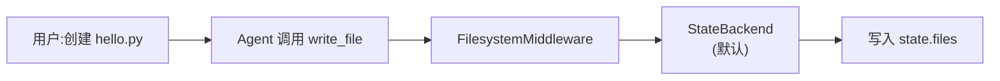
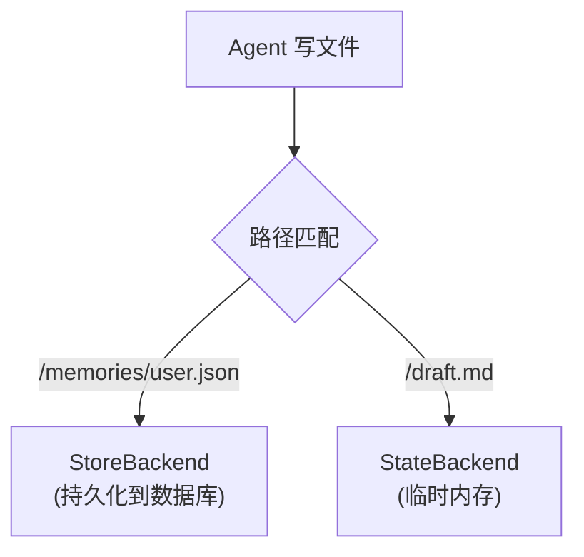

# FilesystemMiddleware 使用指南:从「零配置」到「自定义存储」

## 核心问题:我该怎么让 Agent 能读写文件?

想象你正在写一个 AI Agent,希望它能:
- 写代码到 `app.py`
- 读取 `config.json` 配置
- 搜索项目里的 `TODO` 标记
- 记录用户偏好到 `/memories/user_prefs.json`,下次对话还能读到

**这篇文章只回答一件事**:怎么用 FilesystemMiddleware 实现上述场景,从最简单的「不配置」到复杂的「混合存储」。

---

## 一、零配置使用:最快 5 分钟上手

### 1.1 最简单的方式

使用 `create_deep_agent()` 时,**FilesystemMiddleware 已经默认启用**,不需要任何配置。

```python
from deepagents import create_deep_agent

# 创建 Agent(FilesystemMiddleware 自动启用)
agent = create_deep_agent(
    system_prompt="你是个代码助手,帮我管理项目文件"
)

# 调用 Agent
result = agent.invoke({
    "messages": [
        {"role": "user", "content": "创建一个 hello.py 文件,内容是 print('Hello World')"}
    ]
})
```

**发生了什么?**
1. Agent 自动拥有 7 个文件工具:`ls`、`read_file`、`write_file`、`edit_file`、`glob`、`grep`、`execute`(如果支持沙箱)
2. 文件存储在 **LangGraph 状态的 `state.files` 字段**(StateBackend)
3. 对话结束后,如果没配置 checkpointer,文件就没了(临时存储)

**数据流向**:



### 1.2 Agent 自动拥有的工具

| 工具 | 功能 | 示例用法 |
|-----|------|---------|
| **ls** | 列出目录 | `ls("/")` → 列出根目录文件 |
| **read_file** | 读文件 | `read_file("/config.json")` → 读取配置 |
| **write_file** | 写新文件 | `write_file("/app.py", "print('hello')")` → 创建文件 |
| **edit_file** | 编辑文件 | `edit_file("/app.py", old="hello", new="hi")` → 替换内容 |
| **glob** | 匹配文件名 | `glob("**/*.py")` → 找所有 Python 文件 |
| **grep** | 搜索文本 | `grep("TODO")` → 搜索所有 TODO 标记 |
| **execute** | 执行命令 | `execute("pytest")` → 运行测试(需要沙箱支持) |

**实战案例**:

```python
# 用户:帮我整理项目里的 TODO
agent.invoke({
    "messages": [{"role": "user", "content": "列出项目里所有 TODO,并写到 todos.md"}]
})

# Agent 内部执行:
# 1. grep("TODO", glob="**/*.py") → 搜索所有 .py 文件
# 2. write_file("/todos.md", "# TODO List\n- ...") → 写入总结
```

---

## 二、自定义配置:4 种常见场景

### 2.1 场景 1:操作本地文件(磁盘)

**需求**:Agent 直接操作你电脑上的真实文件。

```python
from deepagents import create_deep_agent
from deepagents.backends import FilesystemBackend

agent = create_deep_agent(
    middleware=[
        FilesystemMiddleware(
            backend=FilesystemBackend(root_dir="/path/to/your/project")
        )
    ],
    system_prompt="你是个代码助手,可以直接修改本地文件"
)

# Agent 现在可以读写 /path/to/your/project 下的真实文件
result = agent.invoke({
    "messages": [{"role": "user", "content": "读取 README.md 的前 10 行"}]
})
```

**关键点**:
- `root_dir`:Agent 的「根目录」,所有文件路径都相对于此
- Agent 写 `/config.json` → 实际写到 `/path/to/your/project/config.json`
- ⚠️ **安全警告**:Agent 能修改你的真实文件,谨慎使用!

**适用场景**:
- 本地开发:Agent 帮你改代码
- 项目管理:Agent 读写 `package.json`、`README.md`
- 代码审查:Agent 分析项目文件

---

### 2.2 场景 2:临时文件 + 持久化记忆(混合存储)

**需求**:
- 临时文件(如草稿):对话结束就丢
- 用户偏好(如 `/memories/` 目录):跨对话保存

```python
from deepagents import create_deep_agent
from deepagents.backends import CompositeBackend, StateBackend, StoreBackend
from deepagents.middleware.filesystem import FilesystemMiddleware
from langgraph.store.memory import InMemoryStore

# 混合 Backend:默认临时存储,/memories/ 路径持久化
backend = CompositeBackend(
    default=StateBackend(),  # 默认:临时存储
    routes={
        "/memories/": StoreBackend()  # /memories/ 开头的文件:持久化
    }
)

agent = create_deep_agent(
    middleware=[FilesystemMiddleware(backend=lambda rt: backend)],
    store=InMemoryStore(),  # StoreBackend 需要 store
    system_prompt="你能记住用户偏好,存到 /memories/ 目录"
)

# 第一次对话:Agent 保存用户偏好
agent.invoke({
    "messages": [{"role": "user", "content": "我喜欢 Python,记住这个偏好"}]
})
# Agent 内部:write_file("/memories/user_prefs.json", '{"language": "Python"}')

# 第二次对话(新会话):Agent 还能读到
agent.invoke({
    "messages": [{"role": "user", "content": "我喜欢什么语言?"}]
})
# Agent 内部:read_file("/memories/user_prefs.json") → '{"language": "Python"}'
```

**路由逻辑**:



**适用场景**:
- 用户偏好设置
- Agent 的长期记忆
- 重要数据持久化,草稿临时存

---

### 2.3 场景 3:自定义工具描述(引导 Agent 行为)

**需求**:改变工具的提示词,让 Agent 更懂你的场景。

```python
from deepagents.middleware.filesystem import FilesystemMiddleware

agent = create_deep_agent(
    middleware=[
        FilesystemMiddleware(
            custom_tool_descriptions={
                "write_file": "写文件时,必须先用 ls 检查目录是否存在!",
                "read_file": "读大文件时,用 offset 和 limit 分页读取,避免上下文溢出",
            }
        )
    ]
)
```

**效果**:
- Agent 调用 `write_file` 前,会先 `ls` 检查目录
- Agent 读大文件时,会自动分页:`read_file("/big.txt", offset=0, limit=100)`

---

### 2.4 场景 4:启用沙箱执行(支持 execute 工具)

**需求**:Agent 能执行 shell 命令(如 `pytest`、`npm run build`)。

```python
from deepagents.backends import SandboxBackendProtocol

# 自定义沙箱 Backend(需要实现 SandboxBackendProtocol)
class MySandboxBackend(SandboxBackendProtocol):
    def execute(self, command: str) -> ExecuteResponse:
        # 实际执行命令的逻辑
        ...

agent = create_deep_agent(
    middleware=[FilesystemMiddleware(backend=MySandboxBackend())],
    system_prompt="你可以执行命令,如运行测试、安装依赖"
)

# Agent 现在可以执行命令
result = agent.invoke({
    "messages": [{"role": "user", "content": "运行 pytest 并报告结果"}]
})
# Agent 内部:execute("pytest") → 返回测试结果
```

**关键点**:
- 只有实现 `SandboxBackendProtocol` 的 Backend 才支持 `execute`
- 默认的 `StateBackend` 和 `FilesystemBackend` **不支持** execute
- DeepAgents 内置沙箱实现:Harbor(见 `libs/harbor`)

---

## 三、进阶配置:完全自定义

### 3.1 自定义 system prompt

```python
from deepagents.middleware.filesystem import FilesystemMiddleware

agent = create_deep_agent(
    middleware=[
        FilesystemMiddleware(
            system_prompt="""## 文件操作规范
            
1. 写文件前必须用 ls 检查目录
2. 读大文件时分页读取(每次 100 行)
3. 重要数据存 /memories/,草稿存 /temp/
            """
        )
    ]
)
```

**效果**:覆盖默认的 `FILESYSTEM_SYSTEM_PROMPT`,让 Agent 遵循你的规范。

### 3.2 大结果自动驱逐

```python
from deepagents.middleware.filesystem import FilesystemMiddleware

agent = create_deep_agent(
    middleware=[
        FilesystemMiddleware(
            tool_token_limit_before_evict=20000  # 超过 20k tokens 就存文件
        )
    ]
)
```

**场景**:
- Agent 执行 `grep("TODO")` 返回 5000 条结果
- FilesystemMiddleware 自动存到 `/large_tool_results/{tool_call_id}`
- Agent 只收到摘要:"结果太大,已保存到文件,请分页读取"

**避免上下文溢出**。

---

## 四、实战案例:研究型 Agent

### 4.1 需求

构建一个研究 Agent:
- 搜索网页(用 Tavily)
- 保存研究结果到文件
- 生成报告

### 4.2 完整代码

```python
import os
from typing import Literal
from tavily import TavilyClient
from deepagents import create_deep_agent

tavily_client = TavilyClient(api_key=os.environ["TAVILY_API_KEY"])

# 搜索工具
def internet_search(
    query: str,
    max_results: int = 5,
    topic: Literal["general", "news", "finance"] = "general",
) -> dict:
    """运行网络搜索"""
    return tavily_client.search(query, max_results=max_results, topic=topic)

# 系统提示
research_instructions = """你是专业研究员。工作流程:

1. 用 internet_search 收集信息
2. 用 write_file 保存原始数据到 /research/data/
3. 用 write_file 生成报告到 /research/report.md

重要:
- 搜索结果太长时,分批保存到多个文件
- 报告要结构化,包含:摘要、关键发现、结论
"""

# 创建 Agent(FilesystemMiddleware 自动启用)
agent = create_deep_agent(
    tools=[internet_search],
    system_prompt=research_instructions,
)

# 调用
result = agent.invoke({
    "messages": [{"role": "user", "content": "研究 LangGraph 是什么,并写一份报告"}]
})

# Agent 执行流程:
# 1. internet_search("LangGraph")
# 2. write_file("/research/data/search_1.json", {...})
# 3. write_file("/research/report.md", "# LangGraph 研究报告\n...")
```

### 4.3 查看结果

```python
# 方法 1:直接读 Agent 的状态
print(result["files"])  # 输出所有文件

# 方法 2:用后续对话读取
agent.invoke({
    "messages": [{"role": "user", "content": "读取报告文件"}]
})
# Agent 会调用:read_file("/research/report.md")
```

---

## 五、常见问题

### 5.1 文件存在哪?

| 配置 | 存储位置 | 持久化 |
|-----|---------|-------|
| **默认(不配置)** | `state.files` | 对话结束就丢 |
| **FilesystemBackend** | 真实磁盘 | 永久保存 |
| **StoreBackend** | LangGraph Store(数据库) | 跨对话保存 |
| **CompositeBackend** | 混合(按路径路由) | 部分持久化 |

### 5.2 怎么让文件跨对话保存?

**方法 1:用 Checkpointer**(保存整个状态)

```python
from langgraph.checkpoint.memory import MemorySaver

agent = create_deep_agent(
    checkpointer=MemorySaver(),  # 状态持久化
)

# 第一次对话
thread_id = {"configurable": {"thread_id": "user123"}}
agent.invoke({"messages": [...]}, config=thread_id)

# 第二次对话(同一个 thread_id)
agent.invoke({"messages": [...]}, config=thread_id)
# Agent 能读到上次对话创建的文件
```

**方法 2:用 CompositeBackend + StoreBackend**(只持久化特定路径)

```python
from deepagents.backends import CompositeBackend, StateBackend, StoreBackend
from deepagents.middleware.filesystem import FilesystemMiddleware
from langgraph.store.memory import InMemoryStore

backend = CompositeBackend(
    default=StateBackend(),
    routes={"/memories/": StoreBackend()}
)

agent = create_deep_agent(
    middleware=[FilesystemMiddleware(backend=lambda rt: backend)],
    store=InMemoryStore(),
)

# 写到 /memories/ 的文件跨对话保存
```

### 5.3 execute 工具不可用怎么办?

**原因**:Backend 不支持 `SandboxBackendProtocol`。

**解决**:
1. 使用支持沙箱的 Backend(如 Harbor 的 `ModalBackend`)
2. 或者自己实现 `SandboxBackendProtocol`:

```python
from deepagents.backends.protocol import SandboxBackendProtocol, ExecuteResponse
import subprocess

class LocalSandbox(SandboxBackendProtocol):
    def execute(self, command: str) -> ExecuteResponse:
        result = subprocess.run(
            command,
            shell=True,
            capture_output=True,
            text=True,
            timeout=30
        )
        return ExecuteResponse(
            output=result.stdout + result.stderr,
            exit_code=result.returncode
        )

agent = create_deep_agent(
    middleware=[FilesystemMiddleware(backend=LocalSandbox())]
)
```

⚠️ **安全警告**:本地执行命令有风险,仅用于开发环境!

### 5.4 怎么限制 Agent 只读不写?

```python
from deepagents.backends import FilesystemBackend
from deepagents.backends.protocol import WriteResult, EditResult

class ReadOnlyBackend(FilesystemBackend):
    def write(self, file_path, content):
        return WriteResult(error="只读模式:不允许写入")
    
    def edit(self, file_path, old_string, new_string, replace_all=False):
        return EditResult(error="只读模式:不允许编辑")

agent = create_deep_agent(
    middleware=[FilesystemMiddleware(backend=ReadOnlyBackend(root_dir="/path"))]
)
```

---

## 六、快速参考

### 6.1 FilesystemMiddleware 参数

```python
FilesystemMiddleware(
    backend=...,  # Backend 实例或工厂函数
    system_prompt="...",  # 自定义系统提示
    custom_tool_descriptions={...},  # 自定义工具描述
    tool_token_limit_before_evict=20000,  # 大结果驱逐阈值
)
```

### 6.2 常用 Backend

```python
# 1. 临时存储(默认)
from deepagents.backends import StateBackend
backend = lambda rt: StateBackend(rt)

# 2. 磁盘存储
from deepagents.backends import FilesystemBackend
backend = FilesystemBackend(root_dir="/path")

# 3. 持久化存储
from deepagents.backends import StoreBackend
backend = lambda rt: StoreBackend(rt)

# 4. 混合存储
from deepagents.backends import CompositeBackend
backend = CompositeBackend(
    default=StateBackend(),
    routes={"/memories/": StoreBackend()}
)
```

### 6.3 使用模式对比

| 使用方式 | 代码 | 适用场景 |
|---------|------|---------|
| **零配置** | `create_deep_agent()` | 临时对话,不需要持久化 |
| **操作磁盘** | `FilesystemMiddleware(backend=FilesystemBackend(...))` | 本地开发,修改真实文件 |
| **混合存储** | `CompositeBackend(...)` | 部分持久化,部分临时 |
| **自定义工具** | `custom_tool_descriptions={...}` | 引导 Agent 行为 |

---

## 七、总结

**FilesystemMiddleware 让 Agent 拥有文件操作能力,关键在于选择合适的 Backend**:
- **不配置**:临时存储,对话结束就丢(适合草稿)
- **FilesystemBackend**:操作真实磁盘(适合本地开发)
- **StoreBackend**:跨对话持久化(适合用户记忆)
- **CompositeBackend**:混合策略(灵活路由)

**核心思想**:
- FilesystemMiddleware 提供工具
- Backend 决定存储位置
- 通过「协议 + 依赖注入」实现可插拔

**下一步**:
- 实战:用 FilesystemMiddleware 构建你的 Agent
- 进阶:自定义 Backend 实现特殊需求(如加密存储)
- 深入:阅读 `docs/FILESYSTEM_MIDDLEWARE_ANALYSIS.md` 了解实现原理
