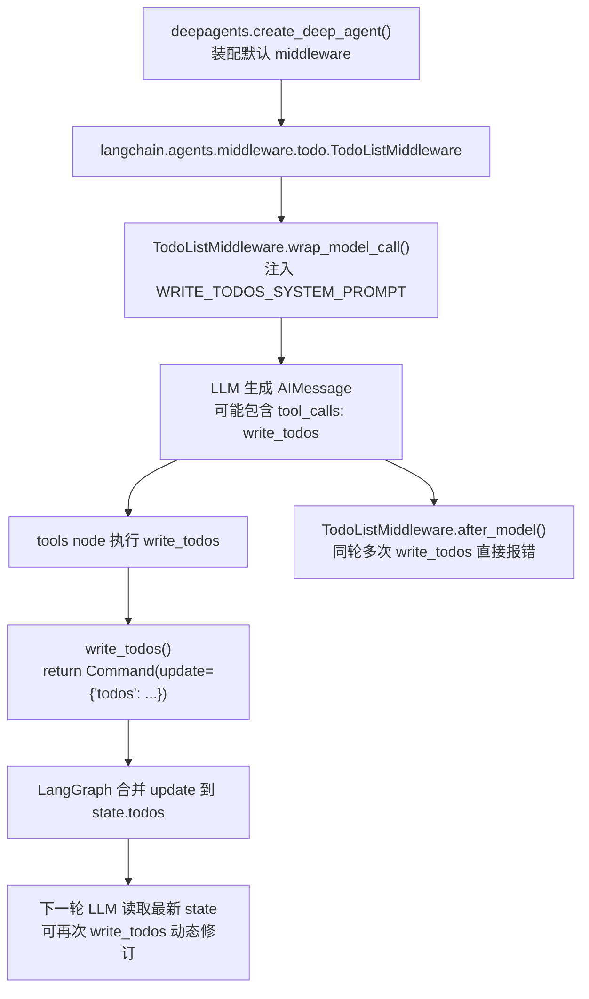

# DeepAgents 的 Planning（规划）机制：Plan 从哪来？为什么又会"改着改着就变了"？

用 DeepAgents 的时候，我总有个疑问：

- todo 列表到底是谁生成的？
- 为什么它能在运行过程中一会儿这样、一会儿那样？

Planning 不是 DeepAgents 自己"发明"的功能，它更像是一个装配好的"小机关"：DeepAgents 默认把 LangChain 的 `TodoListMiddleware` 接上，然后由它去做三件事：

- 往 system message 里塞一段规则，提醒模型要维护 todo
- 提供 `write_todos` 工具，把计划写成结构化状态
- 用 `PlanningState.todos` 把 todo 放进状态机，后续轮次就能反复更新

核心点：**Plan 不是写出来的，是"写进状态"里的。**

---

## Planning 机制概览

**Plan 怎么出现**：`TodoListMiddleware` 会注入 `WRITE_TODOS_SYSTEM_PROMPT`，模型在合适时机会调用 `write_todos`，工具返回 `Command(update={'todos': ...})`，最后落到 `state.todos`。

**Plan 为什么会变**：`write_todos` 走的是"整表覆盖"。你可以在后面的轮次反复改 todo，但同一轮里不允许连续写多次，不然会被判定为错误。

这套设计其实挺像"把计划当成数据结构来管理"，而不是当作文来写。

---

## 为什么要把计划写成状态

软件工程里有个经典场景：让模型/程序写计划，它会写得很好看；真开始执行，计划就成了摆设，没人知道做到哪了，也没人敢改。

于是框架作者干了一件很务实的事：**不让计划停留在文本里，直接把它变成状态字段。**

### 文本计划 vs 状态字段

先看两种方式的区别：

**文本计划（停留在文本里）**：
```
用户：帮我写个网站
AI：好的，我的计划是：
1. 设计数据库结构
2. 搭建后端API
3. 开发前端页面
4. 部署上线
```

这种方式的问题很明显：
- 计划混在对话历史里，难以定位和追踪
- 无法程序化读取和更新，只能靠模型"自觉"维护
- 在长对话中容易"漂移"，被遗忘或忽略
- 无法明确知道每个任务的进度（哪个完成了？哪个进行中？）

**状态字段（变成状态机的一部分）**：
```python
state = {
    "messages": [...],  # 对话历史
    "todos": [          # 结构化计划
        {"content": "设计数据库结构", "status": "completed"},
        {"content": "搭建后端API", "status": "in_progress"},
        {"content": "开发前端页面", "status": "pending"},
        {"content": "部署上线", "status": "pending"}
    ]
}
```

这种方式的核心优势：

| 维度 | 文本计划 | 状态字段 |
|------|---------|---------|
| **可查询** | ❌ 需要解析文本 | ✅ 直接 `state.todos[0].status` |
| **可更新** | ❌ 需要重新生成文本 | ✅ 整表覆盖，规则明确 |
| **可追踪** | ❌ 需要从对话历史推断 | ✅ 每个任务有明确状态 |
| **可持久化** | ❌ 依赖对话历史 | ✅ 独立字段，可 checkpoint |
| **防漂移** | ❌ 容易在长对话中丢失 | ✅ 始终是 state 的一部分 |

### 为什么状态机更可靠？

重点不是"代码维护状态机比文本更可靠"，而是"结构化状态比文本更可靠"：

1. **结构化数据 > 自由文本**
   - `state.todos` 是 `list[Todo]`，每个 Todo 有 `content` 和 `status`（pending/in_progress/completed）
   - 程序可以直接读取和操作，不需要解析文本

2. **明确的更新规则**
   - `write_todos` 是整表覆盖，避免并发冲突
   - 有明确的错误处理（同轮多次写入直接报错）

3. **系统级保证**
   - `OmitFromInput` 确保只能通过工具写入，不能从用户输入注入
   - LangGraph 的状态机引擎保证状态的一致性传递

文本计划容易变成传说，结构化 todo 才能成为"现场指挥"。`write_todos` 的角色就是那面旗。模型不是在写作文，而是在更新状态机里的一个字段。

---

## 调用链路（从装配到落地）



主线流程：**prompt 约束行为 → 工具写入状态 → 下一轮读到最新状态继续推进**。

---

## DeepAgents 做了什么

DeepAgents 的 `create_deep_agent` 做的事情很克制：把 `TodoListMiddleware()` 默认接进来。

```6:9:libs/deepagents/deepagents/graph.py
from langchain.agents.middleware import HumanInTheLoopMiddleware, InterruptOnConfig, TodoListMiddleware
```

`write_todos` 的实现来自 LangChain：

- 文件：`venv/lib/python3.11/site-packages/langchain/agents/middleware/todo.py`
- 核心对象：`TodoListMiddleware`

可以把它理解成：DeepAgents 把"规划模块"作为标配装上车，真正踩油门的是 LangChain，中间的驾驶员还是 LLM。

---

## Plan 怎么形成

Planning 的形成过程，说白了就是三步。

### 1. 先把规矩写进 system prompt

`TodoListMiddleware.wrap_model_call` 会把 `WRITE_TODOS_SYSTEM_PROMPT` 追加到 system message。

```194:210:venv/lib/python3.11/site-packages/langchain/agents/middleware/todo.py
if request.system_message is not None:
    new_system_content = [
        *request.system_message.content_blocks,
        {"type": "text", "text": f"\n\n{self.system_prompt}"},
    ]
...
return handler(request.override(system_message=new_system_message))
```

prompt 里会直接告诉模型：可以用 `write_todos` 来管理复杂目标，并且允许边做边修订。

```105:117:venv/lib/python3.11/site-packages/langchain/agents/middleware/todo.py
You have access to the `write_todos` tool to help you manage and plan complex objectives.
... Don't be afraid to revise the To-Do list as you go.
```

计划不是靠"自觉"，而是靠 system prompt 把偏好固定下来。

### 2. 再给一把"能写进状态"的工具

`TodoListMiddleware.__init__` 会动态创建 `write_todos`，并放到 `self.tools`。

```177:193:venv/lib/python3.11/site-packages/langchain/agents/middleware/todo.py
@tool(description=self.tool_description)
def write_todos(todos: list[Todo], tool_call_id: Annotated[str, InjectedToolCallId]) -> Command:
    return Command(update={
        "todos": todos,
        "messages": [ToolMessage(f"Updated todo list to {todos}", tool_call_id=tool_call_id)],
    })

self.tools = [write_todos]
```

这里我很喜欢它的处理方式：不玩花活，直接整表替换。写状态就写状态，别搞半吊子 patch。

### 3. 最后由状态 schema 承接

`PlanningState` 里声明了 `todos`，并且加了 `OmitFromInput`。

```38:43:venv/lib/python3.11/site-packages/langchain/agents/middleware/todo.py
class PlanningState(AgentState):
    todos: Annotated[NotRequired[list[Todo]], OmitFromInput]
```

这里的 `Todo` 是一个结构化的类型定义：

```28:35:venv/lib/python3.11/site-packages/langchain/agents/middleware/todo.py
class Todo(TypedDict):
    content: str
    status: Literal["pending", "in_progress", "completed"]
```

每个 todo 只有三态：`pending`（待处理）、`in_progress`（进行中）、`completed`（已完成）。

`OmitFromInput` 的意思也很明确：todo 不是从用户输入读进来的，只能由框架内部通过工具调用写进去。即使你在 `agent.invoke()` 时硬塞 `{"todos": ...}`，也不会被当成合法输入的一部分。

Plan 的落地路径：模型调用工具 → 工具返回 `Command(update={'todos': ...})` → 写进 `state.todos`

---

## Plan 为什么能动态变化

动态变化这块，最关键的一点是：`write_todos` 每次写的是整表。

```183:190:venv/lib/python3.11/site-packages/langchain/agents/middleware/todo.py
return Command(update={
    "todos": todos,
    ...
})
```

规则很简单：

- 一次 `write_todos` 对应一次整表覆盖
- 可以跨多轮反复覆盖更新
- 同一轮里不允许出现两次及以上 `write_todos`

为什么同一轮要禁多次？原因也很现实：整表覆盖一旦并发，就会出现"到底谁最后生效"的歧义。

`TodoListMiddleware.after_model` 会专门兜底处理这个情况。

```230:281:venv/lib/python3.11/site-packages/langchain/agents/middleware/todo.py
write_todos_calls = [tc for tc in last_ai_msg.tool_calls if tc["name"] == "write_todos"]
if len(write_todos_calls) > 1:
    error_messages = [ToolMessage(..., tool_call_id=tc["id"], status="error") for tc in write_todos_calls]
    return {"messages": error_messages}
```

这属于典型的工程好品味：与其让状态变得含糊，不如直接判错，逼着下一轮按规矩来。

---

## 这套设计的好处

它把计划从"描述"变成"系统的一部分"：

- 执行时永远读最新的 `state.todos`
- 修订计划不会引入 merge 地狱
- 并发歧义被硬规则挡在门外

项目里也有测试直接断言工具存在。

```8:16:libs/deepagents/tests/utils.py
assert "write_todos" in agent.nodes["tools"].bound._tools_by_name.keys()
```

---

## 总结

DeepAgents 默认装配 LangChain 的 `TodoListMiddleware`，Planning 靠 system prompt 推动模型调用 `write_todos`，再把 todo 以整表覆盖的方式写进 `state.todos`，从而实现可迭代修订，但同轮多次写入会被直接判错。
